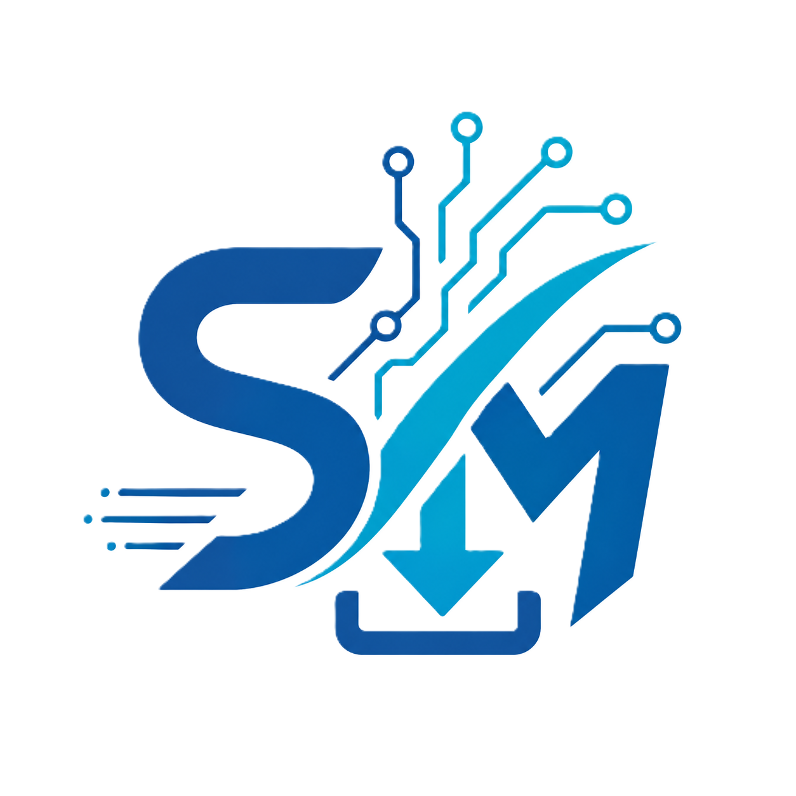

# SmartDM — High-Performance Local-First Download Manager

<p align="center">
  
</p>

<p align="center">
  <strong>A modern, privacy-first, multi-threaded download manager for Windows and Linux built with Java 21 LTS & JavaFX.</strong>
</p>

<p align="center">
  <a href="https://smartdm.web.app"></a>
  <a href="https://github.com/ifahad2k/SmartDM/releases"></a>
  <a href="LICENSE"></a>
  <a href="https://adoptium.net/"></a>
  <a href="https://openjfx.io/"></a>
</p>

---

## 🌟 Overview

**SmartDM** is a high-speed, local-first download manager designed to replace legacy tools with a modern, glassmorphic UI, zero telemetry, and complete privacy. It features multi-threaded segmented downloading, seamless Chrome and Firefox browser capture, native YouTube/TikTok 4K video extraction, and intelligent local file organization.

🌐 **Official Website**: [https://smartdm.web.app](https://smartdm.web.app)  
📥 **Latest Release**: [SmartDM Releases on GitHub](https://github.com/ifahad2k/SmartDM/releases)

---

## ✨ Key Features

* **⚡ Ultra-Fast Segmented Downloads**: Accelerate transfers with multi-connection parallel chunk downloading, dynamic speed throttling, pause, resume, and automated retry logic.
* **🌐 Native Browser Integration**: Intercept download triggers automatically from **Google Chrome** and **Mozilla Firefox** via lightweight browser extensions and Native Messaging IPC.
* **🎥 Media Extraction (YouTube, TikTok, & More)**: Extract 4K/HD video streams and high-bitrate MP3 audio directly using integrated `yt-dlp` and `FFmpeg` engines.
* **🪟 Independent Top-Level Windows**: Download dialogs ("Download File Info", "Enter URL", "Media Extractor") run in independent OS windows with their own taskbar controls so you can work friction-free.
* **📦 Zero-Config Auto-Downloader**: Self-contained installer automatically downloads and sets up an isolated Adoptium OpenJDK 21 JRE runtime if Java is missing on the host machine.
* **🔒 Privacy & Local Encryption**: Local SQLite database encrypted with SQLCipher. No user accounts, cloud sync, telemetry, or remote license verification.
* **📁 Smart Category Organization**: Auto-categorizes incoming files into Music, Videos, Documents, Software, and Archives based on extension and mime-type.
* **🗑️ Settings Uninstaller**: Built-in settings uninstaller option with a user-configurable data wipe checkbox to clear all app data cleanly when needed.

---

## 📥 Installation

### Option 1: Standalone Single-EXE Installer (Recommended for Windows)

1. Download **`SmartDM-Setup-v1.0.7.exe`** from the [GitHub Releases Page](https://github.com/ifahad2k/SmartDM/releases).
2. Double-click to run the setup wizard.
3. The installer will extract SmartDM and automatically download Java 21 OpenJDK runtime if missing on your system.
4. Upon first launch, SmartDM opens a **Guided First-Run Integration Window** to help you configure browser extensions.

### Option 2: Portable Distribution

1. Download `desktop-1.0.6.zip` from the release assets.
2. Extract to your preferred location (e.g., `C:\Program Files\SmartDM` or `~/SmartDM`).
3. Run `SmartDM.exe` (Windows) or `./bin/desktop` (Linux).

---

## 🧩 Browser Extension Setup Guide

SmartDM integrates directly with your browser to catch links automatically.

### 🌐 Google Chrome Setup

1. Open Chrome and navigate to `chrome://extensions/`.
2. Enable **Developer mode** (toggle switch in the top-right corner).
3. Click **Load unpacked**.
4. Select the Chrome Extension folder:
   * Installed location: `%LocalAppData%\SmartDM\extensions\chrome`
   * Portable location: `<SmartDM-Folder>/extensions/chrome`
5. Open SmartDM Settings -> **Browser Integration** -> Click **Install / Register Native Host**.

---

### 🦊 Mozilla Firefox Setup

1. Open Firefox and navigate to `about:debugging#/runtime/this-firefox`.
2. Click **Load Temporary Add-on...**.
3. Select `manifest.json` inside the Firefox Extension folder:
   * Installed location: `%LocalAppData%\SmartDM\extensions\firefox\manifest.json`
   * Portable location: `<SmartDM-Folder>/extensions/firefox/manifest.json`
4. Open SmartDM Settings -> **Browser Integration** -> Click **Install / Register Native Host**.

---

## 🚀 Quick Start / How To Use

1. **Catch Downloads Automatically**: Click any download link in Chrome or Firefox. SmartDM's independent "Download File Info" window will appear.
2. **Add URL Manually**: Click the **"+ Enter URL"** button on the top bar or press `Ctrl + N` to paste any direct download link.
3. **Download YouTube & Media Videos**: Paste a YouTube or video page link into SmartDM. The **Media Extractor** dialog will analyze the formats and let you select 4K, 1080p, 720p video, or audio-only MP3 formats.
4. **Batch Downloads**: Click **"+ Batch Add"** to paste multiple links simultaneously.
5. **Manage & Organize**: Filter downloads by category (All, Downloading, Completed, Music, Video, Documents, Archives, Software) or search files locally.

---

## 🛠️ Technology Stack & Architecture

SmartDM is built using a modern, multi-module Gradle architecture:

* **Core Language**: Java 21 LTS
* **UI Framework**: JavaFX 21 with FXML & custom CSS styling
* **Build System**: Gradle 8.14 (Kotlin DSL)
* **Native Launchers**: C# (.NET Framework 4.8 / Win32)
* **Persistence**: SQLite with SQLCipher encryption
* **IPC Protocol**: Chrome/Firefox Native Messaging JSON API over standard I/O
* **Media Engines**: Integrated `yt-dlp` & `FFmpeg` binaries

---

## 🔧 Building From Source

### Prerequisites

* JDK 21 LTS or later installed
* Git

### Build Steps

```bash
# Clone the repository
git clone https://github.com/ifahad2k/SmartDM.git
cd SmartDM

# Build and verify all modules
./gradlew clean check

# Run Desktop Application locally
./gradlew :apps:desktop:run

# Build Single-EXE Windows Installer
powershell.exe -ExecutionPolicy Bypass -File "tools/scripts/build_single_exe_installer.ps1"
```

---

## 📄 License & Open Source

This project is licensed under the **[GNU General Public License v3.0 (GPLv3)](LICENSE)**.

```
Copyright (C) 2026 SmartDM Contributors / ifahad2k

Everyone is permitted to copy and distribute verbatim copies
of this license document, but changing it is not allowed.
```

See [LICENSE](LICENSE) for the full license text.

---

<p align="center">
  Made with ❤️ by <a href="https://github.com/ifahad2k">ifahad2k</a> & SmartDM Contributors.  
  Visit <a href="https://smartdm.web.app">smartdm.web.app</a> for more information.
</p>
