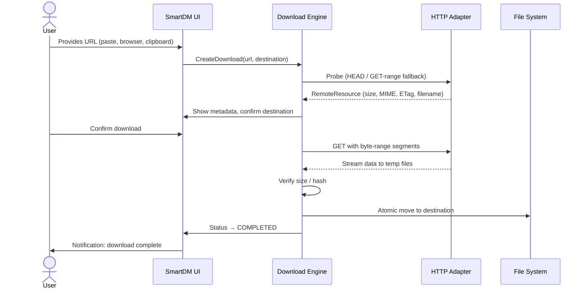
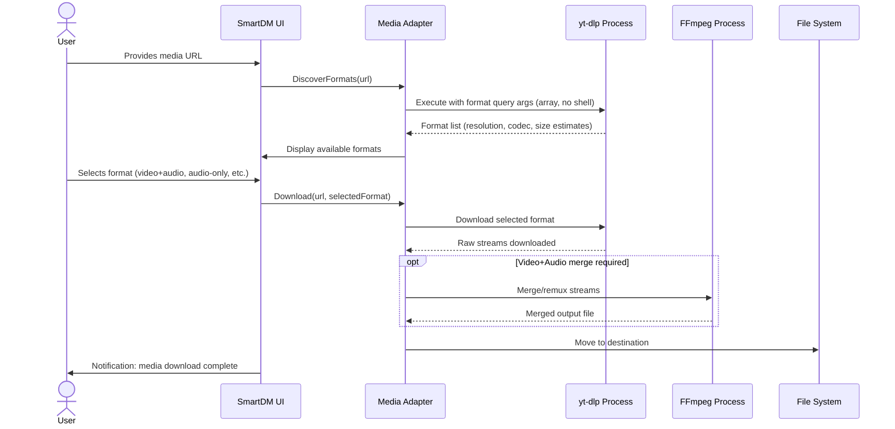
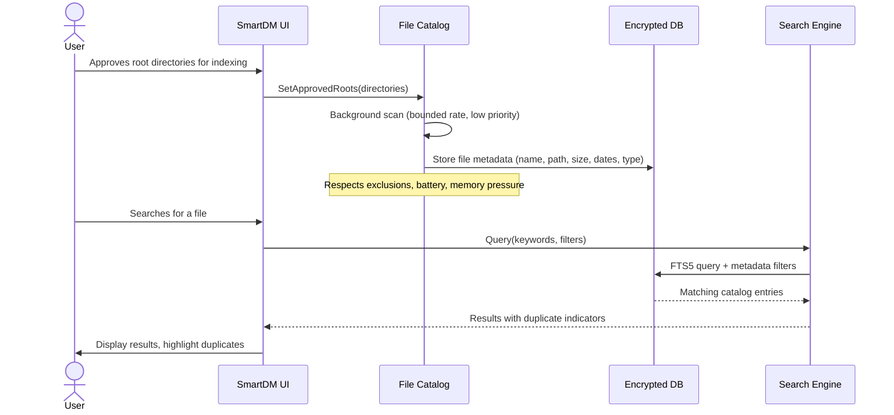
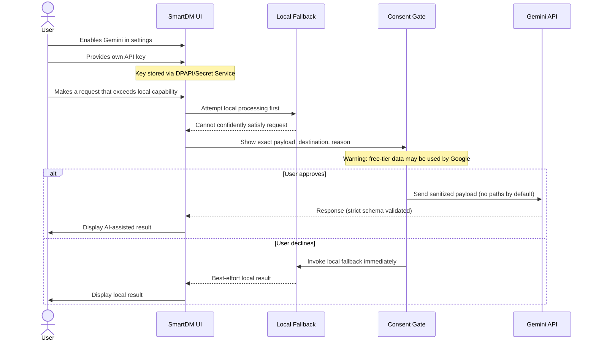

<!-- markdownlint-disable MD013 MD024 -->

# SmartDM — Product Scope

> Authoritative product specification for SmartDM v1.
> Derived from the [Phase-by-Phase Implementation Plan](../implementation/SmartDM-Phase-by-Phase-Implementation-Plan.md), Sections 1–4.
> If this document conflicts with the plan, the plan controls until the conflict is resolved through an approved ADR.

| Field | Value |
|---|---|
| Product | SmartDM |
| Document type | Product scope and specification |
| Status | Approved baseline |
| License | GPL-3.0-or-later |
| Revision | 1.0 |

---

## 1. Product Identity

### 1.1 What SmartDM Is

SmartDM is a **free, local-first, open-source download manager** for **Windows and Linux only**.

| Attribute | Decision |
|---|---|
| Target platforms | Windows and Linux only — **no macOS** |
| Product editions | **One free edition** — no premium tier, no paid feature gates |
| Accounts | **None** — no user accounts, no registration, no login |
| Cloud sync | **None** — no cloud storage, no cross-device sync |
| Telemetry | **None** — no usage analytics, no crash reporting to SmartDM servers |
| License server | **None** — no entitlement checking, no activation |
| SmartDM-owned server | **None** — SmartDM does not operate any backend server |
| Source license | GPL-3.0-or-later |

### 1.2 Technology Stack

| Concern | Technology |
|---|---|
| Language | Java 21 LTS |
| Build system | Gradle (Kotlin DSL) with committed wrapper |
| UI framework | JavaFX with FXML/CSS and presentation view models |
| Database | SQLite with FTS5, encrypted at rest via SQLCipher |
| HTTP client | Java `HttpClient` |
| JSON | Jackson (unsafe polymorphic deserialization disabled) |
| Logging | SLF4J + Logback with privacy-safe encrypted appender |
| Media tools | yt-dlp (subprocess adapter), FFmpeg/FFprobe (subprocess adapter) |
| Windows integration | JNA (inside platform adapters only) |
| Linux integration | XDG directories, portals/desktop integration, Secret Service |
| Browser targets | Google Chrome and Mozilla Firefox |
| AI (optional) | User-keyed Gemini free API, explicit consent gate, local fallback always available |
| Antivirus | Windows Defender adapter; ClamAV adapter on Linux; local rule engine on both |
| Search | SQLite FTS5 + local query parser; optional ONNX semantic pack (never required) |

### 1.3 Permanent Constraints

These are **permanent design decisions**, not placeholders or future work:

1. No macOS support.
2. No account system.
3. No cloud sync.
4. No telemetry backend.
5. No license server.
6. No SmartDM-owned API server.
7. No premium/paid tier or entitlement-gated features.
8. No ads.
9. No feature ships without a free/local path — Gemini failure, refusal, or absence must never break core functionality.
10. No unverified binary is ever downloaded and executed automatically.
11. No downloaded user file is silently re-encrypted or converted.

---

## 2. Supported Protocols (v1)

| Protocol | Status | Notes |
|---|---|---|
| HTTP | ✅ Supported | Full download, probe, redirect handling |
| HTTPS | ✅ Supported | TLS validation always on; no downgrade allowed |
| FTP | ❌ Not in v1 | May be considered in a future version via ADR |
| BitTorrent | ❌ Not in v1 | Out of scope |
| Other | ❌ Not in v1 | No custom protocols |

All network connections from SmartDM are limited to:

- The original file/media host selected by the user
- Optional user-consented Gemini API requests (direct from desktop app)
- Optional yt-dlp, FFmpeg, antivirus-definition, application, and browser-extension update sources
- addons.mozilla.org (free AMO signing for Firefox `.xpi` only)

Every optional connection is documented and independently disableable.

---

## 3. Feature Set (IDM-Parity Table)

The following table defines "everything in IDM" for SmartDM purposes, subject to authorized-content and non-DRM rules.

| # | Feature Family | Required SmartDM Capability | Planned Phase |
|---:|---|---|---:|
| 1 | **Core Transfer** | HTTP/HTTPS downloads, redirects, metadata probe, temp files, atomic completion | 4 |
| 2 | **Acceleration** | Dynamic byte-range segmentation and bounded parallel connections | 5 |
| 3 | **Recovery** | Pause, resume, retry, crash recovery, remote-change detection | 5 |
| 4 | **Queue** | Priorities, reordering, multiple queues, concurrency limits | 6 |
| 5 | **Scheduler** | Start windows, recurring schedules, pause at end, missed-trigger policy | 6 |
| 6 | **Speed Control** | Global, queue, download, and host bandwidth limits | 6 |
| 7 | **Categories** | Rules based on extension, MIME type, host, and user choice | 7, 12 |
| 8 | **Browser Capture** | "Download with SmartDM," ordinary link capture, download-all-links | 8 |
| 9 | **Clipboard** | Detect copied HTTP/HTTPS URLs with user-controlled monitoring | 7 |
| 10 | **Batch Download** | Paste/import URLs and numeric URL patterns | 7, 16 |
| 11 | **Authentication** | Basic/digest-compatible flows where supported, approved headers, proxy auth | 7 |
| 12 | **Cookies/Sessions** | Per-site opt-in handoff from browser; encrypted at rest; never global scraping | 8 |
| 13 | **Proxy** | System, HTTP, and SOCKS proxy profiles with protected credentials | 7 |
| 14 | **Expired Links** | Reprobe and browser-assisted refresh workflow | 8, 16 |
| 15 | **Video/Audio** | Available formats, resolution, size estimate, audio-only, subtitles, merge | 9 |
| 16 | **YouTube Panel** | Icon on thumbnails, no playback required, Chrome and Firefox | 10 |
| 17 | **Site/Link Collector** | User-started page/site link collection with scope and rate limits | 16 |
| 18 | **Duplicate Handling** | Find existing local/download-history matches and offer safe actions | 11 |
| 19 | **Verification** | Size and SHA-256/SHA-512 verification | 5 |
| 20 | **Safety** | Extension/MIME rules, local antivirus, quarantine, warnings | 15 |
| 21 | **Completion Actions** | Notify, open, reveal, optional sleep/shutdown with confirmation | 16 |
| 22 | **Import/Export** | SmartDM JSON/CSV/text; optional compatible legacy import where documented | 16 |
| 23 | **Command Line** | Add, pause, resume, status, import, and safe scripting commands | 16 |
| 24 | **UI** | Minimal list/details layout, themes, keyboard access, helpful errors | 3, 17 |
| 25 | **Search** | Keyword, filters, and natural-language local search | 13 |
| 26 | **Organization** | Smart folder recommendations and learned preferences | 12 |
| 27 | **Diagnostics** | Local logs, health checks, support bundle, no telemetry | 2, 17 |

> [!IMPORTANT]
> A feature is not considered complete because a button exists. It must pass the phase's recovery, failure, security, performance, and acceptance tests.

---

## 4. Authorized-Media and Non-DRM Policy

### 4.1 Policy Statement

The media feature (yt-dlp + FFmpeg integration) is for content the user **owns or is authorized to download**.

| Requirement | Detail |
|---|---|
| DRM bypass | **Prohibited** — SmartDM must not bypass DRM protections |
| Paywall circumvention | **Prohibited** — must not circumvent paywalls or access controls |
| Protected streams | **Prohibited** — must not intercept protected/encrypted streams |
| YouTube ToS | YouTube's Terms of Service restrict downloading except where the service or rights holders explicitly authorize it |
| First-use notice | **Required** — users must acknowledge the authorized-content boundary before first media download |

### 4.2 First-Use Notice Requirements

Before the first media download, SmartDM must display a notice that:

1. States the media feature is for content the user owns or is authorized to download.
2. States that bypassing DRM, paywalls, or access controls is not supported and not intended.
3. References YouTube's Terms of Service restriction on downloading.
4. Requires explicit user acknowledgment before proceeding.
5. Does **not** promise unrestricted downloading from any service.

### 4.3 UI Language Guidelines

| ✅ Acceptable | ❌ Not Acceptable |
|---|---|
| "Download available formats" | "Download any YouTube video" |
| "Media formats detected by yt-dlp" | "Bypass restrictions" |
| "Authorized content download" | "Free YouTube downloader" |
| "Check available formats" | "Rip videos from any site" |

---

## 5. User Journeys

### 5.1 Ordinary Download

**Key states:** `QUEUED` → `PROBING` → `DOWNLOADING` → `VERIFYING` → `COMPLETED`

**Failure paths:** `FAILED` (network error, size mismatch, hash failure) or `CANCELED` (user action)

### 5.2 Media Download

### 5.3 Local Catalog

**Key rules:**
- Only user-approved root directories are indexed
- Catalog records never leave the device automatically
- Scanning pauses during active downloads, on battery, or under memory pressure
- On Potato profile: low-priority indexer, paged DB access, hash only duplicate candidates

### 5.4 AI Privacy Journey

**Consent levels:**

| Level | Behavior | Default? |
|---|---|---|
| `OFF` | Gemini never contacted, no API key needed | ✅ **Default** |
| `ASK_EVERY_TIME` | Exact payload shown before every request; user approves or declines each time | No |
| `ALLOW_SELECTED_SANITIZED_FIELDS` | Pre-approved sanitized fields sent without per-request prompt; user configures which fields | No |

---

## 6. Unsupported Behavior

The UI, documentation, marketing, and code **must not** use or imply the following:

### 6.1 Safety Claims

| ❌ Never Say | ✅ Instead Use |
|---|---|
| "This file is safe" | Scanner state: `NO_THREATS_DETECTED` |
| "AI verified this file" | "AI summary of scanner evidence" |
| "Guaranteed virus-free" | "No known threats detected by [scanner name]" |
| "SmartDM protects you from malware" | "SmartDM integrates with local antivirus scanners" |

**Allowed scanner states only:**

| State | Meaning |
|---|---|
| `UNSCANNED` | No scanner has examined this file |
| `SCANNING` | A scan is in progress |
| `NO_THREATS_DETECTED` | Scanners found nothing known — does **not** mean guaranteed safe |
| `SUSPICIOUS` | Heuristic or rule-based concern detected |
| `MALWARE_DETECTED` | A scanner positively identified a known threat |
| `SCAN_FAILED` | The scan could not complete (scanner unavailable, timeout, error) |

> [!CAUTION]
> AI may summarize evidence and explain warnings, but deterministic security rules and local antivirus engines determine the result. AI-generated text may **never** override or downgrade scanner evidence.

### 6.2 YouTube / Media Claims

| ❌ Never Say | ✅ Instead Say |
|---|---|
| "Download any YouTube video" | "Download authorized media content" |
| "Unlimited YouTube downloads" | "Available formats as reported by yt-dlp" |
| "YouTube downloader" (as product tagline) | "Media download support" |

### 6.3 Gemini Privacy Claims

| ❌ Never Say | ✅ Instead Say |
|---|---|
| "Gemini is private" | "Free-tier Gemini data may be used by Google per their terms" |
| "Your data stays private with AI" | "Local processing is the default; Gemini requires explicit consent" |
| "AI processes your files securely" | "SmartDM never sends file bytes to Gemini" |

### 6.4 Platform Claims

| ❌ Never Say | ✅ Instead Say |
|---|---|
| "Available on macOS" | "Available on Windows and Linux" |
| "Coming soon to macOS" | (Do not reference macOS) |
| "Cross-platform" (implying macOS) | "Windows and Linux" |

### 6.5 Premium / Paid Claims

| ❌ Never Reference | Reason |
|---|---|
| "Premium features" | No premium tier exists |
| "Upgrade to Pro" | No Pro edition exists |
| "Unlock advanced features" | All features are free |
| "Buy a license" | No license purchase exists |
| "Premium support" | No paid support tier exists |

---

## 7. Performance Profiles

SmartDM detects a suggested profile on first run but allows the user to override it.

### 7.1 Profile Definitions

| Profile | Example Hardware | Default Behavior |
|---|---|---|
| **Potato** | 2 CPU cores, 4 GB RAM, HDD or slow SSD | No local embedding model; 2 concurrent downloads; 2 segments each; low-priority indexer; FTS5 and rules only |
| **Standard** | 4+ cores, 8 GB RAM | 3 concurrent downloads; 4 segments; optional semantic pack; normal index rate |
| **Performance** | 8+ cores, 16 GB RAM | Higher user-approved limits; parallel hashing and richer indexing |

### 7.2 Potato-Mode Rules

1. **No local large language model** — do not run any LLM locally.
2. **FTS5 only** — use SQLite FTS5, deterministic query parsing, metadata filters, and a tiny preference-ranking model.
3. **Paged catalog** — keep file catalog paging in the database; do not load the full catalog into memory.
4. **Lazy hashing** — hash only duplicate candidates, not every file immediately.
5. **Adaptive throttling** — pause or throttle scanning while the user is actively downloading, on battery, or under memory pressure.
6. **Bounded workers** — run media metadata extraction in a bounded worker process.
7. **No auto semantic** — do not enable the optional semantic-embedding pack automatically.
8. **Gemini as last resort** — offer Gemini only when the local parser cannot confidently satisfy a request and the user consents.

---

## 8. Performance Budgets

| Measurement | Target | Notes |
|---|---|---:|
| Idle CPU after startup | < 1% average | No background activity when idle |
| Idle resident memory (Potato) | < 220 MiB | Baseline with no active downloads |
| Memory with 100,000 catalog entries | < 350 MiB | Paged DB access, not full in-memory |
| Local metadata search (100k files) | p95 < 300 ms | FTS5 + metadata filters |
| UI progress refresh rate | 4–8 times/second | Coalesced updates, never per-byte |
| Startup (SSD) | < 5 seconds | Cold start to interactive UI |
| Startup (HDD) | < 10 seconds | Cold start to interactive UI |
| Background indexer CPU (Potato) | < 15% average | Configured low priority |
| UI-thread blocking task | < 16 ms | Any task exceeding this must show explicit loading state |

> [!NOTE]
> Budgets are verified in Phase 17 and adjusted only through a documented ADR with measurements. No budget may be relaxed without evidence.

---

## 9. Network Connection Inventory

SmartDM has **no backend server**. All network connections are user-initiated or user-configurable:

| Connection | Purpose | User Control | Required? |
|---|---|---|---|
| File/media host | Download the requested file | User initiates each download | Yes (core function) |
| Gemini API (`generativelanguage.googleapis.com`) | AI-assisted search fallback | Off by default; per-request consent | No |
| yt-dlp update source (`github.com/yt-dlp`) | Update yt-dlp binary | User-initiated; hash-verified | No |
| FFmpeg source (`ffmpeg.org`) | User installs FFmpeg | User responsibility | No |
| ClamAV definitions (`database.clamav.net`) | Antivirus signature updates | System-managed (freshclam) | No |
| Application update source | SmartDM version updates | User-initiated; checksum-verified | No |
| addons.mozilla.org | Firefox extension signing (build-time) | Build/release process only | No |

---

## 10. Distribution Trust Model

| Aspect | Decision |
|---|---|
| Code signing | **Unsigned at launch** — no paid Authenticode certificate |
| Integrity verification | SHA-256 checksum published for every release artifact |
| Future signing | Opportunistic upgrade to free signing (e.g., SignPath.io, cosign/Sigstore) when eligible |
| SmartScreen | "Unrecognized publisher" warning expected and honestly disclosed |
| Chrome extension | Unpacked folder via Developer Mode with fixed manifest `"key"` |
| Firefox extension | AMO-signed unlisted `.xpi` (free, required by Firefox) |
| Linux sandboxing | Snap/Flatpak browser detection with honest capability notice |

> [!WARNING]
> The download page and first-run notice must honestly explain the unsigned status and SmartScreen warning. No phase may weaken this by self-signing with an untrusted throwaway certificate.

---

## 11. Encryption Boundary

| What SmartDM Encrypts | What Remains Unencrypted |
|---|---|
| Database (SQLCipher) | Finished user downloads (original format) |
| Secrets (API keys, credentials) | User's existing files on disk |
| Catalog metadata | |
| Download history | |
| Settings and preferences | |
| Temporary credentials | |
| Production diagnostics and logs | |

> [!NOTE]
> An optional encrypted vault may be designed later, but silently changing every downloaded file into an encrypted container is permanently out of scope.

---

## Revision History

| Date | Revision | Change |
|---|---|---|
| 2026-07-17 | 1.0 | Initial product scope from approved implementation plan |
