# SmartDM Security Fixes — Multi-Agent Implementation Plan

> **Goal:** Fix all 38 findings from the security audit report across 5 phases using parallel AI agents.
> **Strategy:** Group tasks by severity, then maximize parallelism by ensuring no two agents edit the same file concurrently.

---

## Phase 1 — Critical Security Fixes (7 findings)

> [!CAUTION]
> These are exploitable vulnerabilities. Must be fixed before any release.

**Duration:** ~15 minutes with 4 parallel agents

### Agent 1: "API & Crypto Security"

Handles C-1 (API key in URL) and C-5 (Key not zeroed) and H-8 (Key stored in field)

#### Task 1.1 — Move Gemini API Key from URL to Header
**File:** [`GeminiAiAdvisor.java`](file:///e:/skill/projects/smartdm/modules/ai-gemini/src/main/java/io/smartdm/ai/gemini/GeminiAiAdvisor.java)

**Changes:**
- **L57-58:** Change endpoint URL to remove `?key=` parameter:
  ```java
  String endpoint = String.format("%s/v1beta/models/%s:generateContent",
      config.baseUrl(), model);
  ```
- **L68-72:** Add API key as header instead:
  ```java
  HttpRequest request = HttpRequest.newBuilder()
      .uri(URI.create(endpoint))
      .header("Content-Type", "application/json")
      .header("x-goog-api-key", config.apiKey())  // NEW: header instead of URL
      .timeout(Duration.ofSeconds(10))
      .POST(HttpRequest.BodyPublishers.ofString(jsonRequestBody))
      .build();
  ```
- **L89:** Update redaction logic to handle the new location (no longer in URL, but keep redaction for safety)

#### Task 1.2 — Zero Master Key After Use
**File:** [`SmartDmApp.java`](file:///e:/skill/projects/smartdm/apps/desktop/src/main/java/io/smartdm/desktop/SmartDmApp.java)

**Changes:**
- **After L106** (after `new SqlCipherDatabase(dbFile, key)`): Add key zeroing:
  ```java
  java.util.Arrays.fill(key, (byte) 0);
  ```

**File:** [`SqlCipherDatabase.java`](file:///e:/skill/projects/smartdm/modules/persistence-sqlcipher/src/main/java/io/smartdm/persistence/SqlCipherDatabase.java)

**Changes:**
- **L19-31:** Restructure constructor to not store key as a field. Pass the encoded key directly to `SQLiteConfig` and don't retain either `key` or `encodedKey`:
  ```java
  public SqlCipherDatabase(Path dbFile, byte[] key) {
      this.url = "jdbc:sqlite:" + dbFile.toAbsolutePath();
      
      SQLiteConfig config = new SQLiteConfig();
      String encodedKey = Base64.getEncoder().encodeToString(key);
      config.setPragma(SQLiteConfig.Pragma.PASSWORD, encodedKey);
      config.enforceForeignKeys(true);
      
      this.dataSource = new SQLiteDataSource(config);
      this.dataSource.setUrl(url);
      // key and encodedKey go out of scope and become eligible for GC
  }
  ```
- Remove the `private final byte[] key;` field entirely

---

### Agent 2: "Download Engine Security"

Handles C-2 (Hardcoded path) and M-10 (Dead stub method)

#### Task 1.3 — Remove Hardcoded Dev Path, Use Logger
**File:** [`SingleDownloadCoordinator.java`](file:///e:/skill/projects/smartdm/modules/download-engine/src/main/java/io/smartdm/download/engine/SingleDownloadCoordinator.java)

**Changes:**
- **L363-376:** Replace hardcoded crash file path with SLF4J logging:
  ```java
  } catch (Exception e) {
      log.error("Execution failed for download {}", download.id().value(), e);
      // Remove the entire try block that writes to hardcoded path (L364-L376)
      download.updateState(DownloadState.FAILED);
      repository.save(download);
      eventPublisher.publish(new DownloadEvent.StateChanged(download.id(), download.state(), download));
  }
  ```
- **L490-492:** Implement `isAcceptableEndOfStream()`:
  ```java
  private boolean isAcceptableEndOfStream(Exception e) {
      Throwable cause = e.getCause() != null ? e.getCause() : e;
      if (cause instanceof java.io.EOFException) return true;
      if (cause instanceof java.net.SocketException) {
          String msg = cause.getMessage();
          return msg != null && (msg.contains("Connection reset") || msg.contains("Broken pipe"));
      }
      return false;
  }
  ```

---

### Agent 3: "Native Host & IPC Security"

Handles C-3 (JSON injection) and C-7 (IPC token permissions)

#### Task 1.4 — Fix JSON Injection in Native Host
**File:** [`NativeHostMain.java`](file:///e:/skill/projects/smartdm/modules/browser-native-host/src/main/java/io/smartdm/browser/host/NativeHostMain.java)

**Changes:**
- **L73:** Replace string interpolation with proper JSON serialization:
  ```java
  } catch (Exception ex) {
      log.println("Error processing message: " + ex);
      try {
          responseJson = MAPPER.writeValueAsString(
              java.util.Map.of("status", "error", "message", 
                  ex.getMessage() != null ? ex.getMessage() : "Unknown error"));
      } catch (Exception jsonEx) {
          responseJson = "{\"status\":\"error\",\"message\":\"Internal error\"}";
      }
  }
  ```

#### Task 1.5 — Add Timeout to IPC HTTP Request
**Same file, L105-110:** Add request timeout:
  ```java
  HttpRequest request = HttpRequest.newBuilder()
      .uri(URI.create("http://127.0.0.1:" + port + "/api/browser"))
      .header("Authorization", "Bearer " + token)
      .header("Content-Type", "application/json")
      .timeout(java.time.Duration.ofSeconds(15))   // NEW
      .POST(HttpRequest.BodyPublishers.ofByteArray(payload))
      .build();
  ```

#### Task 1.6 — Set Restrictive Permissions on IPC File
> [!NOTE]
> This fix is in the IPC server (LocalIpcServer), which was not directly reviewed in the audit but is the producer of `ipc.info`. The agent should locate this file and add permission-setting logic after the file is written.

**Search for:** `ipc.info` in `modules/application` to find the file creation point.
**Add:** After writing `ipc.info`, set owner-only permissions:
  ```java
  // Windows: use icacls or DACL
  if (System.getProperty("os.name").toLowerCase().contains("win")) {
      new ProcessBuilder("icacls", ipcFile.toString(), "/inheritance:r", 
          "/grant:r", System.getProperty("user.name") + ":F").start().waitFor();
  } else {
      // Linux/Mac
      Files.setPosixFilePermissions(ipcFile, 
          java.nio.file.attribute.PosixFilePermissions.fromString("rw-------"));
  }
  ```

---

### Agent 4: "SSRF & URL Validation"

Handles C-4 (SSRF) and H-4 (Missing URL scheme validation)

#### Task 1.7 — Add URL Hostname Validation to NativeDirectExtractor
**File:** [`NativeDirectExtractor.java`](file:///e:/skill/projects/smartdm/modules/media-ytdlp/src/main/java/io/smartdm/media/ytdlp/NativeDirectExtractor.java)

**Changes:**
- **L37-48:** Add hostname validation in `tryExtract()`:
  ```java
  public Optional<MediaMetadata> tryExtract(String url, String cookies, String userAgent) {
      if (url == null || url.isBlank()) return Optional.empty();
      try {
          URI uri = URI.create(url);
          String scheme = uri.getScheme();
          if (scheme == null || (!scheme.equals("http") && !scheme.equals("https"))) {
              return Optional.empty();
          }
          String host = uri.getHost();
          if (host == null || host.isBlank()) return Optional.empty();
          
          if (url.contains("youtube.com") || url.contains("youtu.be")) {
              return extractYouTubeDirect(url, cookies, userAgent);
          } else if (url.contains("facebook.com") || url.contains("fb.watch")) {
              return extractFacebookDirect(url, cookies, userAgent);
          }
      } catch (Exception e) { ... }
      return Optional.empty();
  }
  ```
- **L140-146:** Add hostname validation in `extractFacebookDirect()`:
  ```java
  private Optional<MediaMetadata> extractFacebookDirect(String url, ...) throws Exception {
      URI parsedUri = URI.create(url);
      String host = parsedUri.getHost();
      if (host == null || !(host.endsWith("facebook.com") || host.endsWith("fb.watch"))) {
          return Optional.empty(); // Prevent SSRF
      }
      // ... rest of method
  }
  ```

#### Task 1.8 — Add URL Scheme Validation to HttpProbeClient
**File:** [`HttpProbeClient.java`](file:///e:/skill/projects/smartdm/modules/download-http/src/main/java/io/smartdm/download/http/HttpProbeClient.java)

**Changes:**
- **L100, top of `probeAsync()`:** Add scheme check:
  ```java
  public CompletableFuture<ProbeResult> probeAsync(SourceUri uri, AuthCredential credential) {
      String scheme = uri.value().getScheme();
      if (scheme == null || (!scheme.equalsIgnoreCase("http") && !scheme.equalsIgnoreCase("https"))) {
          return CompletableFuture.failedFuture(
              new IllegalArgumentException("Only HTTP/HTTPS URLs are supported, got: " + scheme));
      }
      // ... rest of method
  }
  ```

---

### ⏸️ C-6 (Browser Preferences Injection) — Deferred

> [!IMPORTANT]
> C-6 (Browser extension installation via Secure Preferences injection) is a **design-level change** that requires product-level decisions about extension distribution strategy (Chrome Web Store vs. sideloading vs. enterprise policy). This should be addressed as a separate feature ticket, not a quick fix.

---

## Phase 2 — High Severity Fixes (12 findings)

> [!WARNING]
> These issues can cause resource exhaustion, data corruption, or security weakening.

**Duration:** ~20 minutes with 5 parallel agents
**Dependency:** Start after Phase 1 completes (some agents edit the same files as Phase 1)

### Agent 5: "Cache & Memory"

Handles H-1 (Unbounded caches)

#### Task 2.1 — Bound Metadata Caches with LRU Eviction
**File:** [`YtDlpExtractor.java`](file:///e:/skill/projects/smartdm/modules/media-ytdlp/src/main/java/io/smartdm/media/ytdlp/YtDlpExtractor.java)

**Changes at L22:** Replace `ConcurrentHashMap` with bounded `LinkedHashMap`:
```java
private final java.util.Map<String, MediaMetadata> metadataCache = 
    java.util.Collections.synchronizedMap(new java.util.LinkedHashMap<>(64, 0.75f, true) {
        @Override
        protected boolean removeEldestEntry(java.util.Map.Entry<String, MediaMetadata> eldest) {
            return size() > 100;
        }
    });
```

**File:** [`SmartDmApp.java`](file:///e:/skill/projects/smartdm/apps/desktop/src/main/java/io/smartdm/desktop/SmartDmApp.java)

**Same change at L55.**

---

### Agent 6: "TLS & Network Security"

Handles H-2 (TLS bypass), H-3 (Redirect policy)

#### Task 2.2 — Remove `--no-check-certificates` from yt-dlp
**File:** [`YtDlpExtractor.java`](file:///e:/skill/projects/smartdm/modules/media-ytdlp/src/main/java/io/smartdm/media/ytdlp/YtDlpExtractor.java)

**Changes:**
- **L82:** Remove `"--no-check-certificates"` from the command list (both primary at L82 and fallback at L125)

#### Task 2.3 — Change Redirect Policy to NORMAL
**File:** [`HttpProbeClient.java`](file:///e:/skill/projects/smartdm/modules/download-http/src/main/java/io/smartdm/download/http/HttpProbeClient.java)
- **L61:** Change `HttpClient.Redirect.ALWAYS` → `HttpClient.Redirect.NORMAL`

**File:** [`NativeDirectExtractor.java`](file:///e:/skill/projects/smartdm/modules/media-ytdlp/src/main/java/io/smartdm/media/ytdlp/NativeDirectExtractor.java)
- **L33:** Change `HttpClient.Redirect.ALWAYS` → `HttpClient.Redirect.NORMAL`

---

### Agent 7: "Thread Safety & Concurrency"

Handles H-5 (Race condition), H-7 (Unbounded threads)

#### Task 2.4 — Fix ConcurrentModification in QueueCoordinator
**File:** [`QueueCoordinator.java`](file:///e:/skill/projects/smartdm/modules/download-engine/src/main/java/io/smartdm/download/engine/queue/QueueCoordinator.java)

**Changes at L79-84:** Collect-then-remove pattern:
```java
if (queue.getStatus() == DownloadQueue.Status.PAUSED) {
    List<DownloadId> toPause = new ArrayList<>(activeInQueue);
    for (DownloadId activeId : toPause) {
        starter.pauseDownload(activeId);
    }
    activeInQueue.clear();
    continue;
}
```

#### Task 2.5 — Bound Thread Pools
**File:** [`SingleDownloadCoordinator.java`](file:///e:/skill/projects/smartdm/modules/download-engine/src/main/java/io/smartdm/download/engine/SingleDownloadCoordinator.java)

**Changes at L82:**
```java
this.segmentExecutor = new java.util.concurrent.ThreadPoolExecutor(
    4, 32, 60L, TimeUnit.SECONDS,
    new java.util.concurrent.LinkedBlockingQueue<>(256),
    r -> { Thread t = new Thread(r, "segment-worker"); t.setDaemon(true); return t; },
    new java.util.concurrent.ThreadPoolExecutor.CallerRunsPolicy()
);
```

**File:** [`SmartDmApp.java`](file:///e:/skill/projects/smartdm/apps/desktop/src/main/java/io/smartdm/desktop/SmartDmApp.java)

**Changes at L120-124:**
```java
enginePool = new java.util.concurrent.ThreadPoolExecutor(
    2, 16, 60L, TimeUnit.SECONDS,
    new java.util.concurrent.LinkedBlockingQueue<>(128),
    r -> { Thread t = new Thread(r, "smartdm-engine"); t.setDaemon(true); return t; },
    new java.util.concurrent.ThreadPoolExecutor.CallerRunsPolicy()
);
```

---

### Agent 8: "File Security"

Handles H-6 (Temp cookies), H-10 (Quarantine path traversal)

#### Task 2.6 — Secure Temp Cookie File Handling
**File:** [`YtDlpExtractor.java`](file:///e:/skill/projects/smartdm/modules/media-ytdlp/src/main/java/io/smartdm/media/ytdlp/YtDlpExtractor.java)

**Changes at L67-71:**
```java
cookieFile = java.nio.file.Files.createTempFile("smartdm_cookies_", ".txt");
cookieFile.toFile().deleteOnExit();  // Safety net for JVM crash
// Set permissions on all platforms
try {
    java.nio.file.Files.setPosixFilePermissions(cookieFile,
        java.nio.file.attribute.PosixFilePermissions.fromString("rw-------"));
} catch (UnsupportedOperationException e) {
    // Windows: permissions inherited from user temp dir, acceptable
}
java.nio.file.Files.writeString(cookieFile, cleanCookies, StandardCharsets.UTF_8);
```

#### Task 2.7 — Fix Quarantine Restore Path Traversal
**File:** [`LocalQuarantineManager.java`](file:///e:/skill/projects/smartdm/modules/safety-rules/src/main/java/io/smartdm/safety/rules/LocalQuarantineManager.java)

**Changes at L151, add validation:**
```java
String safeFilename = record.originalFilename()
    .replace("..", "")
    .replaceAll("[/\\\\]", "_");
if (safeFilename.isBlank()) safeFilename = "restored_" + quarantineId;

Path restoreDestination = targetDirectory.resolve(safeFilename).normalize();
if (!restoreDestination.startsWith(targetDirectory.normalize())) {
    throw new SecurityException("Path traversal detected in quarantine restore: " + record.originalFilename());
}
```

---

### Agent 9: "Encoding & Error Handling"

Handles H-11 (Charset), H-12 (Silent errors), H-9 (Process timeout — done by Agent 3 in Task 1.5)

#### Task 2.8 — Fix Basic Auth Charset Encoding
**File:** [`HttpProbeClient.java`](file:///e:/skill/projects/smartdm/modules/download-http/src/main/java/io/smartdm/download/http/HttpProbeClient.java)

**Changes at L130 and L221:** Add charset specification:
```java
String basicAuth = Base64.getEncoder().encodeToString(
    (credential.username() + ":" + credential.password()).getBytes(java.nio.charset.StandardCharsets.UTF_8));
```

**File:** [`SingleDownloadCoordinator.java`](file:///e:/skill/projects/smartdm/modules/download-engine/src/main/java/io/smartdm/download/engine/SingleDownloadCoordinator.java)

**Same change at L242.**

#### Task 2.9 — Fix Silent Error Swallowing in BrowserIntegrationInstallerService
**File:** [`BrowserIntegrationInstallerService.java`](file:///e:/skill/projects/smartdm/modules/browser-protocol/src/main/java/io/smartdm/browser/protocol/BrowserIntegrationInstallerService.java)

**Changes at L201-208:**
```java
private static int runCmd(String... args) {
    try {
        ProcessBuilder pb = new ProcessBuilder(args);
        pb.redirectErrorStream(true);
        Process p = pb.start();
        // Drain output to prevent blocking
        try (var is = p.getInputStream()) { is.readAllBytes(); }
        int exitCode = p.waitFor();
        if (exitCode != 0) {
            System.err.println("Command failed (exit " + exitCode + "): " + String.join(" ", args));
        }
        return exitCode;
    } catch (Exception e) {
        System.err.println("Command execution failed: " + String.join(" ", args) + " - " + e.getMessage());
        return -1;
    }
}
```
- Update all call sites to check return value and set `success = false` if any critical `reg add` fails

---

## Phase 3 — Medium Severity & Efficiency (11 findings)

> [!NOTE]
> Performance improvements and maintainability refactors. Safe to parallelize.

**Duration:** ~25 minutes with 4 parallel agents
**Dependency:** Start after Phase 2 completes

### Agent 10: "HTTP Request Factory Extraction"

Handles M-1 (Code duplication — biggest refactor)

#### Task 3.1 — Create Shared HttpRequestFactory
**New File:** `modules/download-http/src/main/java/io/smartdm/download/http/HttpRequestFactory.java`

Create a utility class that consolidates the duplicated request-building logic:
```java
package io.smartdm.download.http;

public class HttpRequestFactory {
    private static final String DEFAULT_USER_AGENT = "Mozilla/5.0 ...";
    
    public static HttpRequest.Builder createBase(SourceUri uri, AuthCredential credential) {
        // Consolidated: User-Agent, Accept headers, Referer by domain,
        // Basic Auth, Cookie parsing — all in one place
    }
}
```

Then update these files to use it:
- [`HttpProbeClient.java`](file:///e:/skill/projects/smartdm/modules/download-http/src/main/java/io/smartdm/download/http/HttpProbeClient.java) — L100-138 and L190-230
- [`SingleDownloadCoordinator.java`](file:///e:/skill/projects/smartdm/modules/download-engine/src/main/java/io/smartdm/download/engine/SingleDownloadCoordinator.java) — L214-251

This removes ~120 lines of duplicated code.

---

### Agent 11: "Database & Schedule Optimization"

Handles M-3 (N+1 queries), M-4 (Schedule polling interval)

#### Task 3.2 — Fix N+1 Query in findAll()
**File:** [`SqlCipherDownloadRepository.java`](file:///e:/skill/projects/smartdm/modules/persistence-sqlcipher/src/main/java/io/smartdm/persistence/SqlCipherDownloadRepository.java)

**Changes to `findAll()` (L140-153):**
```java
@Override
public List<Download> findAll() {
    String sql = "SELECT d.*, s.segment_index, s.start_offset, s.current_offset, s.end_offset " +
                 "FROM download d LEFT JOIN download_segment s ON d.id = s.download_id " +
                 "ORDER BY d.id, s.segment_index ASC";
    // Group results by download ID in a single pass
    Map<String, Download> downloadMap = new LinkedHashMap<>();
    try (Connection conn = database.getConnection();
         PreparedStatement stmt = conn.prepareStatement(sql);
         ResultSet rs = stmt.executeQuery()) {
        while (rs.next()) {
            String id = rs.getString("id");
            Download d = downloadMap.computeIfAbsent(id, k -> mapRowWithoutSegments(rs));
            if (rs.getString("segment_index") != null) {
                d.segments().add(new DownloadSegment(...));
            }
        }
    }
    return new ArrayList<>(downloadMap.values());
}
```

Also add a `mapRowWithoutSegments(ResultSet)` helper that builds the Download without the segment sub-query.

#### Task 3.3 — Reduce Schedule Evaluation Frequency
**File:** [`ScheduleRunner.java`](file:///e:/skill/projects/smartdm/modules/download-engine/src/main/java/io/smartdm/download/engine/schedule/ScheduleRunner.java)

**Change L35:**
```java
executor.scheduleAtFixedRate(this::evaluateSchedules, 0, 30, TimeUnit.SECONDS);
```

---

### Agent 12: "Logging & Hash Performance"

Handles M-5 (System.out logging), M-6 (Hash buffer), M-7 (Hex encoding), M-2 (Backoff)

#### Task 3.4 — Add Logger and Replace System.out in Key Files
**Files to update** (add `private static final Logger log = LoggerFactory.getLogger(...)` and replace `System.out/err.println`):
- [`YtDlpExtractor.java`](file:///e:/skill/projects/smartdm/modules/media-ytdlp/src/main/java/io/smartdm/media/ytdlp/YtDlpExtractor.java)
- [`NativeDirectExtractor.java`](file:///e:/skill/projects/smartdm/modules/media-ytdlp/src/main/java/io/smartdm/media/ytdlp/NativeDirectExtractor.java)
- [`SmartDmApp.java`](file:///e:/skill/projects/smartdm/apps/desktop/src/main/java/io/smartdm/desktop/SmartDmApp.java) (all `System.out.println` → `log.info`)

#### Task 3.5 — Improve Hash Verification Performance
**File:** [`SingleDownloadCoordinator.java`](file:///e:/skill/projects/smartdm/modules/download-engine/src/main/java/io/smartdm/download/engine/SingleDownloadCoordinator.java)

**Changes at L335:**
```java
byte[] buffer = new byte[65536]; // Was 8192
```

**Changes at L342-346:**
```java
String actualHash = java.util.HexFormat.of().formatHex(hashBytes); // Java 17+
```

#### Task 3.6 — Fix Backoff Strategy
**File:** [`SegmentWorker.java`](file:///e:/skill/projects/smartdm/modules/download-engine/src/main/java/io/smartdm/download/engine/SegmentWorker.java)

**Changes at L139-145:**
```java
if (attempt < maxRetries) {
    try {
        // Exponential backoff with jitter: 1s, 2s, 4s, 8s, 16s...
        long baseDelay = 1000L * (1L << Math.min(attempt, 5));
        long jitter = (long) (Math.random() * baseDelay * 0.3);
        Thread.sleep(baseDelay + jitter);
    } catch (InterruptedException ie) {
        Thread.currentThread().interrupt();
        return null;
    }
}
```

---

### Agent 13: "Architecture & Safety"

Handles M-8 (God method), M-9 (FileChannel sync), M-11 (.gitignore)

#### Task 3.7 — Update .gitignore
**File:** [`.gitignore`](file:///e:/skill/projects/smartdm/.gitignore)

**Replace with:**
```gitignore
# Build
.gradle/
build/
**/build/
out/
*.class

# IDE
.idea/
*.iml
.vscode/
.settings/
.classpath
.project

# OS
.DS_Store
Thumbs.db
desktop.ini

# App artifacts
*.part
*.log
*.patch
out*.txt

# Gradle
!gradle/wrapper/gradle-wrapper.jar
!gradle-wrapper.properties

# Temp/test files at root
*.class
test*.js
test*.json
bad_cookies*.txt
smartdm_crash.txt
smartdm_worker_crash.txt
scratch/
```

#### Task 3.8 — Add Thread-Safety Note to SegmentedFileChannel
**File:** [`SegmentedFileChannel.java`](file:///e:/skill/projects/smartdm/modules/download-engine/src/main/java/io/smartdm/download/engine/SegmentedFileChannel.java)

**Changes at L28:** Add documentation and optional synchronization:
```java
/**
 * Writes data at the specified offset. Thread-safe for positional writes
 * on standard JVM implementations (FileChannel.write(buf, pos) is atomic
 * for non-overlapping regions).
 */
public void writeAt(long offset, byte[] data, int length) throws IOException {
    ByteBuffer buffer = ByteBuffer.wrap(data, 0, length);
    long currentOffset = offset;
    while (buffer.hasRemaining()) {
        int written = channel.write(buffer, currentOffset);
        currentOffset += written;
    }
}
```

#### Task 3.9 — Decompose SmartDmApp.start() (Structural Outline)

> [!NOTE]
> This is a large refactor. The agent should extract the following methods from `start()`:
> - `initPlatformAndSecurity(Stage)` → returns `PlatformContext` record (directories, keyManager, key, profileLock)
> - `initDatabase(PlatformContext)` → returns `DatabaseContext` record (database, repositories)
> - `initEngine(DatabaseContext, PlatformContext)` → returns `EngineContext` record (coordinator, httpClient, pool, rateLimiter)
> - `initUI(Stage, EngineContext, DatabaseContext)` → creates workspace, shell, scene
> - `initIPC(EngineContext, ...)` → starts IPC server
>
> Each extracted method should be <100 lines. The `start()` method becomes a 20-line orchestrator calling these methods in sequence.

---

## Phase 4 — Low Priority Cleanup (8 findings)

**Duration:** ~10 minutes with 1 agent
**Dependency:** Start after Phase 3 completes

### Agent 14: "Code Cleanup"

#### Task 4.1 — Fix All LOW Findings (Single Batch)

| Finding | File | Fix |
|---------|------|-----|
| L-1: Duplicate import | `SmartDmApp.java` L15 | Remove duplicate `import io.smartdm.desktop.shell.AuthDialog;` |
| L-2: Log writer not closed | `NativeHostMain.java` | Minor — add comment documenting it's intentional (process lifetime) |
| L-3: `System.gc()` | `SmartDmApp.java` L653 | Remove the `System.gc()` call |
| L-4: Dead variables | `NativeDirectExtractor.java` L182, L189 | Use `cleanHd`/`cleanSd` in the `MediaFormat` constructor, or remove `unescapeJson()` calls |
| L-5: Broad exceptions | Multiple files | No change — document as accepted risk for resilience |
| L-6: Volatile check | `TokenBucketRateLimiter.java` L48 | Move initial `bytesPerSecondLimit` read inside lock, or document the double-check pattern |
| L-7: Redundant ternary | `NativeDirectExtractor.java` L123 | Simplify: `String ext = mimeType.contains("webm") ? "webm" : (isAudio ? "m4a" : "mp4");` |
| L-8: Committed binaries | Root directory | Delete `.class` files, `out*.txt`, `app_run.log` from git tracking with `git rm --cached` |

---

## Phase 5 — Verification

**Duration:** ~10 minutes with 2 parallel agents
**Dependency:** After Phase 4 completes

### Agent 15: "Build & Test Runner"

#### Task 5.1 — Build Verification
```bash
cd e:\skill\projects\smartdm
.\gradlew clean build -x test    # Verify compilation
.\gradlew test                   # Run all unit tests
```

#### Task 5.2 — Verify Key Security Fixes
- Confirm `GeminiAiAdvisor` no longer puts API key in URL (grep for `?key=`)
- Confirm no hardcoded `e:/skill` paths remain (grep for `e:/skill` and `e:\\skill`)
- Confirm `--no-check-certificates` is removed (grep for `no-check-cert`)
- Confirm no `System.gc()` calls remain
- Confirm no `.class` files in root

### Agent 16: "Security Regression Check"

#### Task 5.3 — Targeted Security Verification
- Verify `ipc.info` file permissions after IPC server starts
- Verify cookie temp files are created with restrictive permissions
- Verify quarantine restore rejects path-traversal filenames
- Verify `NativeDirectExtractor` rejects non-HTTP URLs
- Verify Basic Auth encodes with UTF-8

---

## Agent Allocation Summary

```mermaid
gantt
    title Multi-Agent Execution Timeline
    dateFormat X
    axisFormat %s min

    section Phase 1 (Critical)
    Agent 1 - API Key & Crypto          :a1, 0, 5
    Agent 2 - Download Engine            :a2, 0, 4
    Agent 3 - Native Host & IPC          :a3, 0, 5
    Agent 4 - SSRF & URL Validation      :a4, 0, 4

    section Phase 2 (High)
    Agent 5 - Cache & Memory             :a5, 5, 8
    Agent 6 - TLS & Network              :a6, 5, 8
    Agent 7 - Thread Safety              :a7, 5, 9
    Agent 8 - File Security              :a8, 5, 8
    Agent 9 - Encoding & Errors          :a9, 5, 9

    section Phase 3 (Medium)
    Agent 10 - HTTP Factory              :a10, 9, 14
    Agent 11 - Database & Schedule       :a11, 9, 13
    Agent 12 - Logging & Performance     :a12, 9, 13
    Agent 13 - Architecture              :a13, 9, 14

    section Phase 4 (Low)
    Agent 14 - Code Cleanup              :a14, 14, 17

    section Phase 5 (Verify)
    Agent 15 - Build & Test              :a15, 17, 20
    Agent 16 - Security Checks           :a16, 17, 20
```



---

## File Conflict Matrix

Each cell shows which agent edits the file. **No two agents in the same phase touch the same file.**

| File | Ph1 | Ph2 | Ph3 | Ph4 |
|------|-----|-----|-----|-----|
| `GeminiAiAdvisor.java` | A1 | — | — | — |
| `SmartDmApp.java` | A1 | A5, A7 | A12, A13 | A14 |
| `SqlCipherDatabase.java` | A1 | — | — | — |
| `SingleDownloadCoordinator.java` | A2 | A9 | A10, A12 | — |
| `NativeHostMain.java` | A3 | — | — | A14 |
| `NativeDirectExtractor.java` | A4 | A6 | A12 | A14 |
| `HttpProbeClient.java` | A4 | A6, A9 | A10 | — |
| `YtDlpExtractor.java` | — | A5, A6 | A12 | — |
| `QueueCoordinator.java` | — | A7 | — | — |
| `LocalQuarantineManager.java` | — | A8 | — | — |
| `BrowserIntegrationInstallerService.java` | — | A9 | — | — |
| `SqlCipherDownloadRepository.java` | — | — | A11 | — |
| `ScheduleRunner.java` | — | — | A11 | — |
| `SegmentWorker.java` | — | — | A12 | — |
| `SegmentedFileChannel.java` | — | — | A13 | — |
| `.gitignore` | — | — | A13 | — |
| `TokenBucketRateLimiter.java` | — | — | — | A14 |

> [!IMPORTANT]
> Within each phase, agents marked for the **same file** (e.g., A5 and A7 both touch `SmartDmApp.java` in Phase 2) should be sequenced or merged. The plan above ensures this: A5 edits L55 (cache) while A7 edits L120 (thread pool) — different regions, but should be sequenced to avoid merge conflicts.
