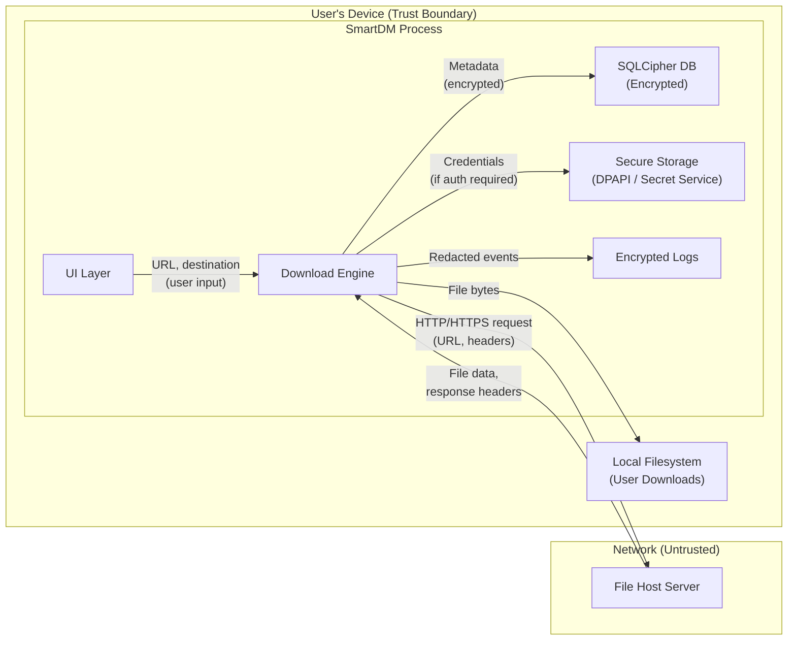
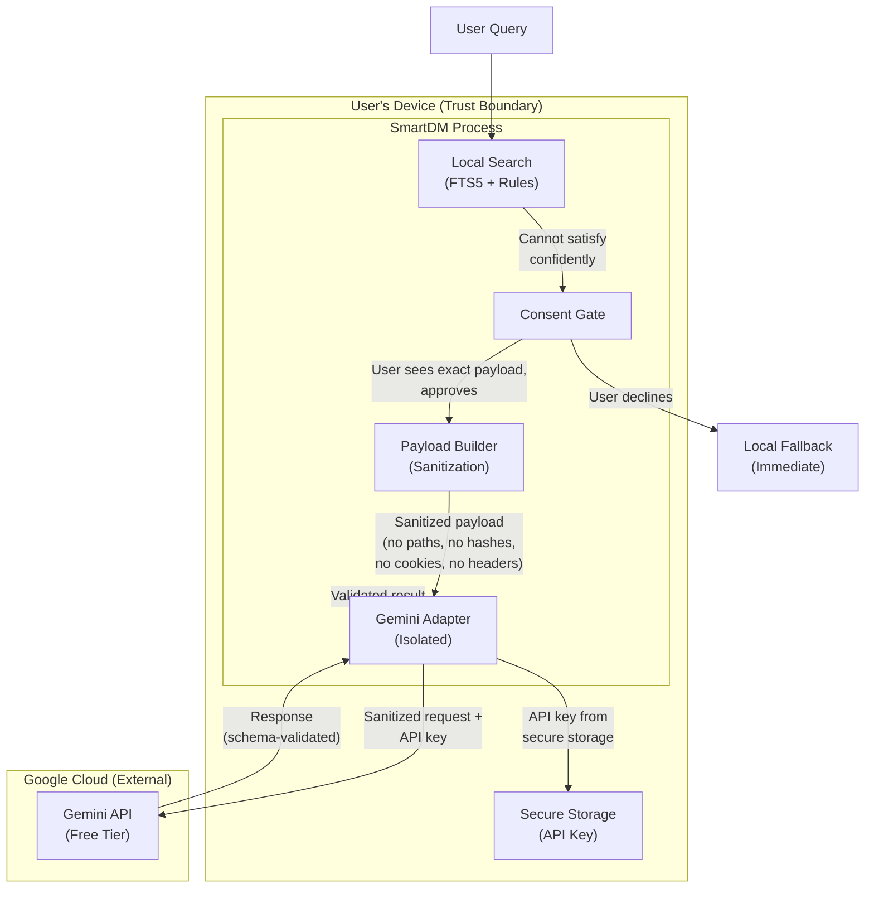
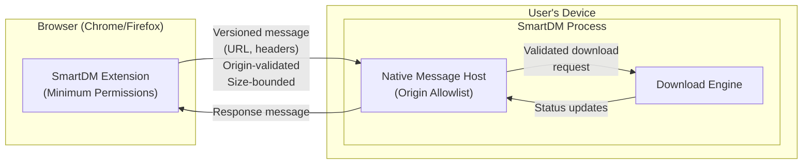
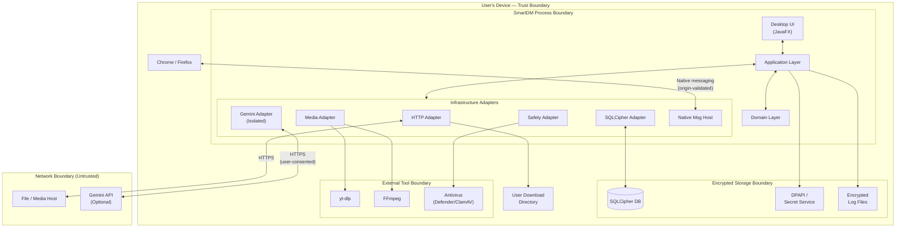
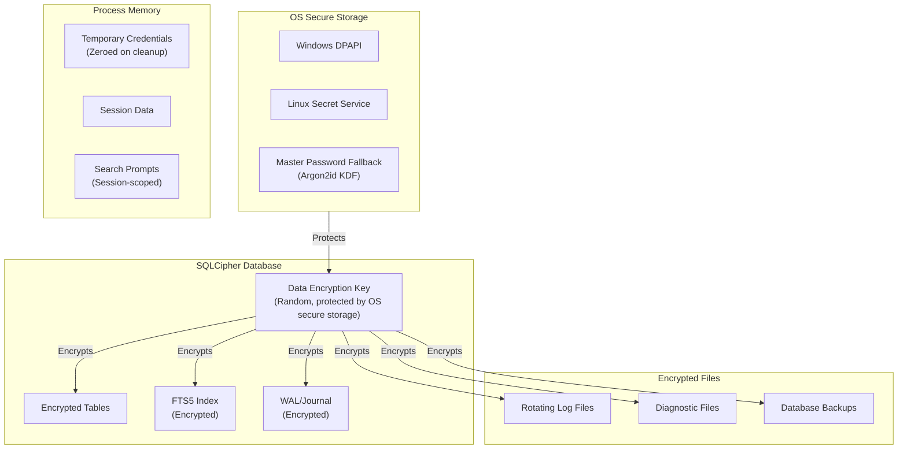

<!-- markdownlint-disable MD013 MD024 -->

# SmartDM — Data Inventory

> Comprehensive inventory of all data fields collected, processed, and stored by SmartDM.
> This document is a Phase 0 deliverable required by the [Implementation Plan](../implementation/SmartDM-Phase-by-Phase-Implementation-Plan.md), Section 10 (0.3).

| Field | Value |
|---|---|
| Product | SmartDM |
| Document type | Privacy data inventory |
| Status | Approved baseline |
| Revision | 1.0 |
| Classification scheme | Critical / High / Medium / Low-Medium / Low |

---

## 1. Data Classification Scheme

| Sensitivity Level | Definition | Examples |
|---|---|---|
| **Critical** | Credentials or keys whose exposure enables unauthorized access or impersonation | API keys, cookies, temporary auth credentials |
| **High** | Data that reveals specific user behavior, contains authentication artifacts, or could enable account compromise if combined | HTTP headers (auth/cookie), detailed log entries |
| **Medium** | Data that reveals user activity patterns or file organization but is not directly credential material | URLs, file paths, download history, catalog metadata, diagnostic events |
| **Low-Medium** | Data with limited identifying value on its own but potentially identifying when aggregated | Filenames, search prompts |
| **Low** | Data with no meaningful privacy impact in isolation | File hashes, application settings, scanner states |

---

## 2. Complete Data Field Inventory

| # | Data Field | Sensitivity | Storage Location | Encrypted at Rest | Retention | Allowed Destination | Gemini Eligible | Notes |
|---:|---|---|---|---|---|---|---|---|
| 1 | **URL** | Medium | SQLCipher DB | ✅ Yes | Until user deletes download | File host only (for download) | Sanitized only (domain may be sent; full path stripped by default) | URLs may contain query parameters with tokens; these are encrypted and never logged verbatim |
| 2 | **File path** (destination) | Medium | SQLCipher DB | ✅ Yes | Until user deletes download | Never auto-sent anywhere | No by default | Reveals directory structure and user organization; never included in Gemini payloads unless user explicitly opts in |
| 3 | **Filename** | Low-Medium | SQLCipher DB | ✅ Yes | Until user deletes download | Never auto-sent anywhere | Only with explicit user inclusion per-request | Remote filename from Content-Disposition or URL; sanitized before storage |
| 4 | **HTTP headers** (response) | High | SQLCipher DB (encrypted columns) | ✅ Yes | Until download completes + configurable cleanup | File host only (sent as part of request) | ❌ Never | Includes Set-Cookie, auth challenges, server info; auth-related headers get additional column-level encryption |
| 5 | **Cookies** | Critical | SQLCipher DB (encrypted columns) | ✅ Yes | Session or user-defined expiry | Origin host only (per-site opt-in) | ❌ Never | Per-site opt-in handoff from browser only; never global cookie scraping; encrypted with additional column-level key |
| 6 | **File hash** (SHA-256/SHA-512) | Low | SQLCipher DB | ✅ Yes | Until user deletes download | Never leaves device | ❌ Never | Used for verification and duplicate detection only; never sent to any external service |
| 7 | **Download history** | Medium | SQLCipher DB | ✅ Yes | Until user deletes entries | ❌ Never sent anywhere | ❌ Never | Includes timestamps, states, sizes, error codes; all queryable locally only |
| 8 | **Catalog metadata** | Medium | SQLCipher DB | ✅ Yes | Until user deletes or re-scans | ❌ Never sent anywhere | Sanitized fields only with explicit consent | File name, size, dates, type, path within approved roots; never auto-exported |
| 9 | **Search prompts** | Low-Medium | Memory + SQLCipher DB (if history enabled) | ✅ Yes | Session or user-configured | Never by default | Only with `ASK_EVERY_TIME` consent | Natural-language queries; local FTS5 processing first; Gemini only on explicit user approval per-request |
| 10 | **API key** (Gemini) | Critical | Secure storage (DPAPI on Windows / Secret Service on Linux) | ✅ Yes (OS-level protection) | Until user removes | Gemini API endpoint only (`generativelanguage.googleapis.com`) | N/A — is the credential itself | Never stored in DB, logs, config files, or environment variables; master-password fallback on Linux without Secret Service |
| 11 | **Logs** (application) | Low–High (content-dependent) | Encrypted rotating log files | ✅ Yes | Rotating / user-configurable size and age | ❌ Never auto-sent | ❌ Never | Structured redaction applied before write; secrets, URLs, paths, and PII redacted; included in support bundle only after user preview |
| 12 | **Settings / preferences** | Low | SQLCipher DB | ✅ Yes | Persistent (until user changes) | ❌ Never sent anywhere | ❌ Never | Theme, profile, queue config, consent level, approved roots, proxy config (credentials stored separately) |
| 13 | **Temporary credentials** (Basic/Digest auth) | Critical | Memory + secure storage (DPAPI / Secret Service) | ✅ Yes | Minimal / session-scoped | Origin host only | ❌ Never | Used only for the specific download requiring authentication; cleared after session or user-defined period |
| 14 | **Diagnostic events** | Medium | SQLCipher DB or encrypted file | ✅ Yes | Rotating / configurable | Only in user-previewed support bundle | ❌ Never | Structured events with diagnostic IDs; no PII in event payload; user must preview and approve before any export |
| 15 | **Proxy credentials** | Critical | Secure storage (DPAPI / Secret Service) | ✅ Yes | Until user removes | Proxy server only | ❌ Never | Stored separately from proxy configuration; never in logs or config exports |
| 16 | **Browser extension messages** | Medium | Memory (transient) | N/A (in-transit only) | Transient — not persisted | SmartDM native host only | ❌ Never | Origin-validated, size-bounded; versioned protocol; never stored long-term |
| 17 | **Queue / scheduler config** | Low | SQLCipher DB | ✅ Yes | Persistent | ❌ Never | ❌ Never | Schedule times, priorities, bandwidth limits |
| 18 | **yt-dlp format metadata** | Low-Medium | Memory (transient) + SQLCipher DB (selected format) | ✅ Yes (DB portion) | Until user deletes media download | ❌ Never | ❌ Never | Format list from yt-dlp; only selected format persisted |

---

## 3. Gemini Consent Levels

SmartDM implements three consent levels for Gemini API interaction. **`OFF` is the default.**

### 3.1 Consent Level Definitions

| Level | Behavior | User Action Required | Data Sent | Default? |
|---|---|---|---|---|
| **`OFF`** | Gemini is never contacted; no API key needed; all processing is local | None — this is the default | Nothing | ✅ **Yes** |
| **`ASK_EVERY_TIME`** | Before every Gemini request, SmartDM displays the exact payload, destination URL, reason for the request, and a warning about free-tier data terms; user approves or declines each time | User must approve each individual request after reviewing payload | Only the specific sanitized fields shown in the preview | No |
| **`ALLOW_SELECTED_SANITIZED_FIELDS`** | User pre-approves specific sanitized fields (e.g., file type, size range) to be sent without per-request prompts; full payloads still require per-request approval | User configures allowed fields in settings; reviews and approves the field list | Only pre-approved sanitized fields | No |

### 3.2 Gemini Data Rules

| Rule | Enforcement |
|---|---|
| Gemini is **off by default** | `OFF` is the initial consent level for all new installations |
| User supplies their own API key | SmartDM never provides, bundles, or shares an API key |
| Exact payload preview before sending (in `ASK_EVERY_TIME`) | UI displays the complete JSON payload, destination URL, and reason |
| Free-tier data warning | Every consent prompt includes: "Google's free Gemini tier may use your data to improve their products. Human reviewers may process inputs and outputs." |
| **Never sent to Gemini** | File bytes, file contents, complete directory trees, hashes, browser cookies, authorization headers, arbitrary system metadata, log contents |
| Paths and filenames stripped by default | Removed unless user explicitly includes them with understanding of disclosure |
| Decline → immediate local fallback | No degraded experience, no retry prompts, no guilt-tripping UI |
| Gemini adapter isolation | Gemini adapter receives only an `ApprovedPayload` object; cannot access repositories, filesystems, catalogs, or secret stores directly |

### 3.3 Free-Tier Data Warning Text

> [!WARNING]
> The following warning (or equivalent) must be displayed in every Gemini consent prompt:
>
> "You are using Google's free Gemini API tier. According to Google's terms, free-tier content may be used to improve Google products, and human reviewers may process inputs and outputs. Do not send personal or sensitive information. SmartDM has removed paths and filenames from this request by default."

---

## 4. Data That NEVER Leaves the Device

The following data categories are **never transmitted** to any external service under any configuration, consent level, or user action:

| Data Category | Reason |
|---|---|
| File bytes / file contents | SmartDM never uploads user files |
| Complete directory trees | Reveals full filesystem structure |
| File hashes (SHA-256/SHA-512) | Used for local verification and duplicate detection only |
| Browser cookies | Sent only to their origin host for download authentication |
| Authorization headers | Sent only to the authenticating host |
| Database encryption keys | Protected by DPAPI/Secret Service; never transmitted |
| Full download history | Local-only queryable record |
| Log file contents | Included in support bundle only after user preview and approval |
| Scanner verdicts / antivirus results | Local processing only |
| System metadata (OS version, hardware, etc.) | Not collected; not transmitted |

---

## 5. Data Flow Diagrams

### 5.1 Ordinary Download Data Flow

### 5.2 Gemini Consent Data Flow

### 5.3 Browser Extension Data Flow

### 5.4 Complete Data Flow Overview

---

## 6. Retention Policies

### 6.1 Retention Schedule

| Data Category | Default Retention | User Control | Deletion Method |
|---|---|---|---|
| Download metadata (URL, path, filename, size) | Until user deletes the download entry | Delete individual entries or clear all history | Secure deletion from SQLCipher DB |
| HTTP response headers | Until download completes + configurable cleanup period | Configurable cleanup interval | Secure deletion from DB |
| Cookies | Session-scoped or user-defined expiry per site | Per-site management; clear all | Secure deletion from DB |
| File hashes | Until user deletes the download entry | Deleted with parent download entry | Secure deletion from DB |
| Download history | Until user deletes entries | Delete individual or clear all | Secure deletion from DB |
| Catalog metadata | Until user deletes or re-scans approved roots | Remove roots; clear catalog | Secure deletion from DB |
| Search prompt history | Session-only by default; optionally persisted if user enables | Clear search history; disable persistence | Memory cleared on exit; DB cleared on request |
| API key | Until user removes from settings | Remove in settings UI | Secure deletion from OS secure storage |
| Application logs | Rotating by size and age (configurable) | Configure rotation; delete log files | Encrypted files deleted; rotation enforced |
| Settings/preferences | Persistent until user changes | Reset to defaults available | Overwritten in DB |
| Temporary credentials | Minimal / session-scoped | Clear on session end or user action | Memory zeroed; secure storage cleared |
| Diagnostic events | Rotating / configurable retention | Configure retention; clear diagnostics | Secure deletion from DB |
| Proxy credentials | Until user removes proxy configuration | Remove in settings UI | Secure deletion from OS secure storage |

### 6.2 Automatic Cleanup

| Trigger | Action |
|---|---|
| Download completion + cleanup interval | Remove transient HTTP headers beyond what's needed for resume |
| Session end | Clear temporary credentials from memory; zero sensitive buffers |
| Log rotation | Delete oldest encrypted log files when size/count threshold exceeded |
| Diagnostic rotation | Delete oldest diagnostic events based on configured retention |
| Catalog root removal | Delete all catalog entries for the removed root directory |
| Application uninstall | User guidance provided for complete data removal (DB, logs, secure storage, config) |

---

## 7. User Data Rights

SmartDM provides the following data management capabilities to users:

### 7.1 Right to View

| Data | How to View |
|---|---|
| Download history | Main download list with full metadata |
| Catalog entries | Catalog browser with search and filters |
| Settings/preferences | Settings UI |
| Stored cookies | Per-site cookie management UI |
| Search history | Search history panel (if persistence enabled) |
| Diagnostic events | Diagnostics panel in settings |
| Logs | Log viewer in diagnostics (redacted view) |

### 7.2 Right to Export

| Data | Export Format | Privacy Controls |
|---|---|---|
| Download history | JSON / CSV | User selects which fields to include |
| Catalog metadata | JSON / CSV | User selects which fields to include |
| Settings | JSON | Excludes credentials and encryption keys |
| Support bundle | ZIP (optionally password-encrypted) | User previews all contents before export; redacted by default |
| Download list | Text / URL list | URLs only; no metadata unless user opts in |

> [!IMPORTANT]
> Every export operation shows a preview of what will be exported. No export includes credentials, encryption keys, or cookies unless the user explicitly and separately enables credential export with an additional confirmation.

### 7.3 Right to Delete

| Data | Deletion Scope | Confirmation Required |
|---|---|---|
| Individual download entry | Metadata, headers, hash, history for that download | Yes |
| All download history | All download metadata and history | Yes (destructive action) |
| Individual catalog root | All catalog entries under that root | Yes |
| All catalog data | Complete catalog database | Yes (destructive action) |
| Search history | All stored search prompts | Yes |
| Cookies (per-site) | Cookies for a specific origin | Yes |
| Cookies (all) | All stored cookies | Yes (destructive action) |
| API key | Gemini API key from secure storage | Yes |
| Proxy credentials | Stored proxy authentication | Yes |
| Logs | All log files | Yes |
| Diagnostic data | All diagnostic events | Yes |
| Complete profile reset | All SmartDM data (fresh start) | Yes (destructive, requires typed confirmation) |

---

## 8. Storage Architecture

---

## 9. Third-Party Data Sharing Summary

| Recipient | Data Shared | Condition | User Control |
|---|---|---|---|
| **File host server** | URL, HTTP request headers | Always (required for download) | User initiates each download |
| **Gemini API** | Sanitized query fields only (no paths, hashes, cookies, headers by default) | Only when consent level ≠ `OFF` AND user approves | Off by default; per-request or pre-approved fields |
| **Proxy server** | Download traffic + proxy credentials | Only when user configures a proxy | User configures proxy settings |
| **Origin host** (cookies) | Per-site cookies | Only for sites with opt-in cookie handoff | Per-site opt-in only |
| **Antivirus engine** | File bytes (local scanner) | When safety scan is performed | Local only; no network transmission |
| **No other recipient** | — | SmartDM has no backend server, no analytics, no telemetry | — |

> [!CAUTION]
> SmartDM does **not** operate any server. There is no telemetry endpoint, no crash reporting server, no analytics service. The application verifiably makes zero connections to SmartDM-owned infrastructure.

---

## Revision History

| Date | Revision | Change |
|---|---|---|
| 2026-07-17 | 1.0 | Initial data inventory from approved implementation plan |
