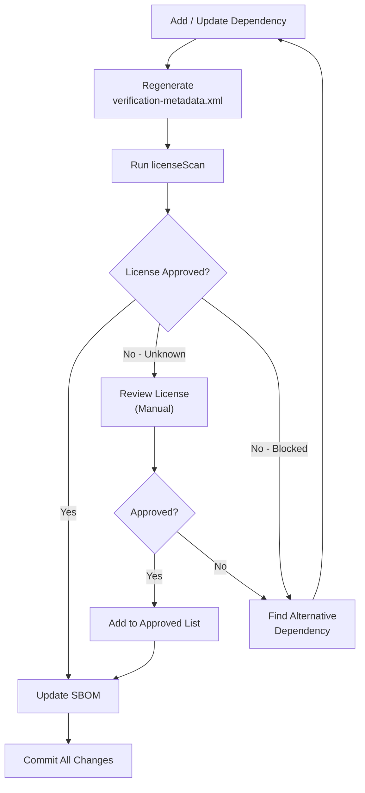
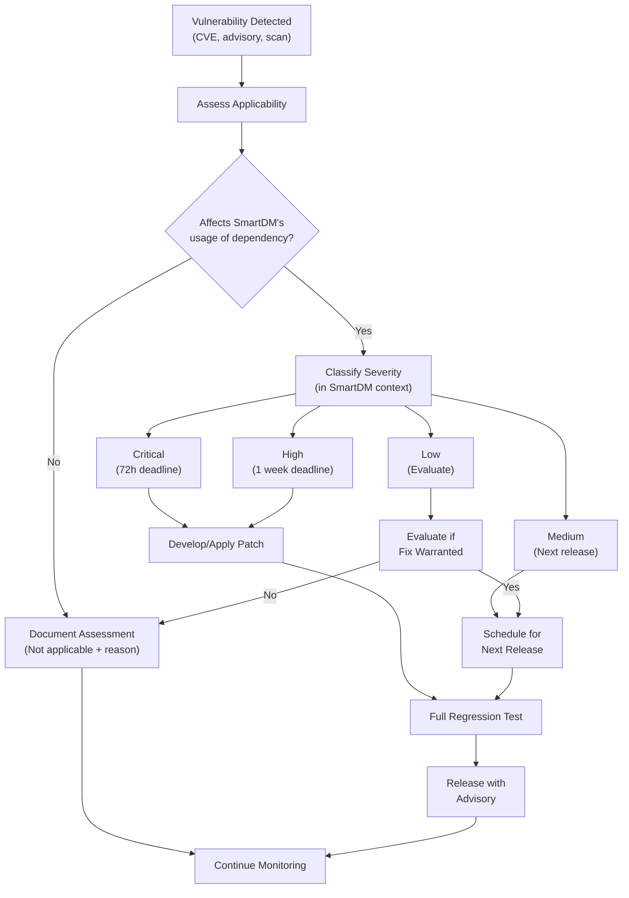
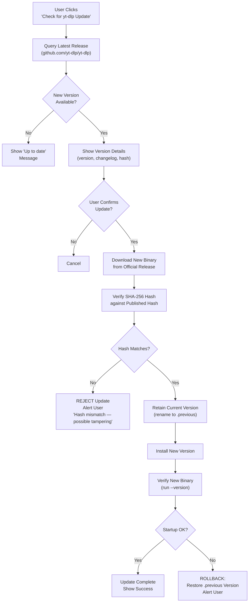
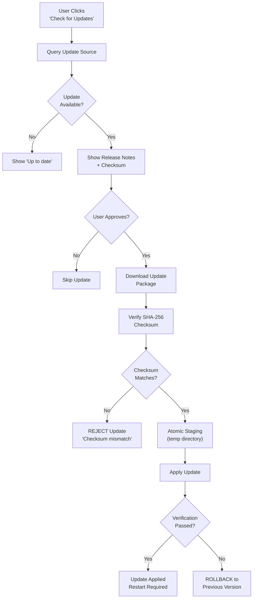

<!-- markdownlint-disable MD013 MD024 -->

# SmartDM — Supply Chain Policy

> Comprehensive supply chain security policy governing dependency sources, verification, SBOM generation, license compliance, and vulnerability response.
> This document is a Phase 0 deliverable required by the [Implementation Plan](../implementation/SmartDM-Phase-by-Phase-Implementation-Plan.md), Section 10 (0.4).

| Field | Value |
|---|---|
| Product | SmartDM |
| Document type | Supply chain security policy |
| Status | Approved baseline |
| Revision | 1.0 |
| Enforcement | Mandatory for all phases |

---

## 1. Official Dependency Sources Allowlist

### 1.1 Core Dependencies

Only the following sources are approved for SmartDM dependencies. Any dependency from an unapproved source **blocks the build** until reviewed and approved through an ADR.

| # | Dependency | Intended Use | Approved Source | Verification Method | License | Distribution |
|---:|---|---|---|---|---|---|
| 1 | **OpenJDK** (Java 21 LTS) | Runtime | Adoptium / Eclipse Temurin | GPG signature + SHA-256 checksum from adoptium.net | GPL-2.0 with Classpath Exception | Bundled in platform runtime image |
| 2 | **OpenJFX** | UI framework | openjfx.io / Maven Central | Gradle dependency verification (verification-metadata.xml) | GPL-2.0 with Classpath Exception | Bundled in platform runtime image |
| 3 | **Gradle** | Build system | gradle.org | Wrapper distribution SHA-256 checksum (committed in `gradle/wrapper/gradle-wrapper.properties`) | Apache-2.0 | Build-time only; wrapper committed |
| 4 | **SQLite / SQLCipher** | Encrypted local database | Maven Central / zetetic.net | Gradle dependency verification; SQLCipher source hash from zetetic.net | SQLite: Public Domain; SQLCipher: BSD-3-Clause | Bundled native library |
| 5 | **Jackson** | JSON parsing | Maven Central | Gradle dependency verification | Apache-2.0 | Bundled |
| 6 | **SLF4J** | Logging API | Maven Central | Gradle dependency verification | MIT | Bundled |
| 7 | **Logback** | Logging implementation | Maven Central | Gradle dependency verification | EPL-1.0 / LGPL-2.1 | Bundled |
| 8 | **JNA** | Native OS access | Maven Central | Gradle dependency verification | Apache-2.0 / LGPL-2.1 | Bundled |
| 9 | **yt-dlp** | Media metadata and transfer | github.com/yt-dlp/yt-dlp (GitHub Releases) | SHA-256 hash of pinned release binary | Unlicense | Bundled or user-installed; pinned version |
| 10 | **FFmpeg / FFprobe** | Media merge, remux, extraction | ffmpeg.org | User responsibility (guided setup with verification instructions) | LGPL-2.1+ or GPL-2.0+ (build-dependent) | User-installed; guided setup |
| 11 | **ClamAV** | Linux malware scanning | clamav.net | System package manager verification | GPL-2.0 | System-installed; detected by SmartDM |

### 1.2 Test Dependencies (Build-Time Only)

| # | Dependency | Intended Use | Approved Source | Verification Method | License |
|---:|---|---|---|---|---|
| 1 | **JUnit 5** | Unit testing | Maven Central | Gradle dependency verification | EPL-2.0 |
| 2 | **AssertJ** | Test assertions | Maven Central | Gradle dependency verification | Apache-2.0 |
| 3 | **Mockito** | Test mocking (seams only) | Maven Central | Gradle dependency verification | MIT |
| 4 | **TestFX** | UI testing | Maven Central | Gradle dependency verification | EUPL-1.1 |

### 1.3 Build Plugins (Build-Time Only)

| # | Plugin | Purpose | Approved Source | Verification Method |
|---:|---|---|---|---|
| 1 | **CycloneDX Gradle Plugin** | SBOM generation | Gradle Plugin Portal / Maven Central | Gradle dependency verification |
| 2 | **License Report Plugin** | License compliance scanning | Gradle Plugin Portal / Maven Central | Gradle dependency verification |
| 3 | **Spotless / code formatting** | Code style enforcement | Gradle Plugin Portal / Maven Central | Gradle dependency verification |
| 4 | **Static analysis plugins** | Code quality | Gradle Plugin Portal / Maven Central | Gradle dependency verification |

### 1.4 Source Blocklist

The following sources are **never approved** for SmartDM dependencies:

| Source | Reason |
|---|---|
| Random GitHub repositories (not official project repos) | Unverified provenance |
| Direct JAR downloads from personal websites | No integrity verification chain |
| Maven mirrors without checksum verification | Potential for supply chain injection |
| npm, PyPI, or other non-JVM repositories (for JVM deps) | Wrong ecosystem; verification mismatch |
| Unsigned binary downloads | No integrity guarantee |
| Forks of official projects without reviewed reason | May contain modifications |

---

## 2. Hash and Signature Requirements

### 2.1 Maven / Gradle Dependencies

| Requirement | Detail |
|---|---|
| **Verification mechanism** | Gradle dependency verification via `gradle/verification-metadata.xml` |
| **What is verified** | SHA-256 checksums and (where available) PGP signatures for all dependencies including transitive |
| **Generation** | `./gradlew --write-verification-metadata sha256,pgp` |
| **Enforcement** | Build fails on any checksum mismatch or missing verification entry |
| **Update process** | When adding/updating a dependency: regenerate verification-metadata.xml, review new entries, commit to version control |
| **Tampering detection** | CI rejects builds where verification-metadata.xml is missing or incomplete |

### 2.2 yt-dlp

| Requirement | Detail |
|---|---|
| **Pinned version** | Specific release version pinned in configuration |
| **Hash verification** | SHA-256 hash of the pinned release binary stored in project configuration |
| **Update process** | User-initiated only; new version downloaded → hash verified against published hash → previous version retained for rollback |
| **Source** | Only from `github.com/yt-dlp/yt-dlp/releases` |
| **Binary integrity** | Hash checked on every startup before execution |
| **Rollback** | Previous verified version retained; automatic rollback on hash mismatch |

```
# Example verification record (actual values set at release time)
yt-dlp:
  version: "2024.12.23"
  platform:
    windows:
      binary: "yt-dlp.exe"
      sha256: "<hash-from-official-release>"
    linux:
      binary: "yt-dlp"
      sha256: "<hash-from-official-release>"
  source: "https://github.com/yt-dlp/yt-dlp/releases/tag/2024.12.23"
```

### 2.3 FFmpeg

| Requirement | Detail |
|---|---|
| **Installation** | User responsibility (SmartDM provides guided setup) |
| **Verification guidance** | SmartDM displays expected SHA-256 hash from ffmpeg.org for the recommended build |
| **License review** | Build configuration must be reviewed for license compliance (LGPL vs GPL) |
| **Source offer** | If GPL-licensed FFmpeg build is bundled in the future, source offer and notices must be provided per GPL requirements |
| **SmartDM's responsibility** | Provide verification instructions; display hash; detect installed version |
| **Not SmartDM's responsibility** | Ensuring user downloads from correct source (guidance only) |

### 2.4 Application Updates

| Requirement | Detail |
|---|---|
| **Checksum** | SHA-256 checksum published alongside every release artifact |
| **Future signatures** | Detached signatures using cosign/Sigstore or GPG when feasible (opportunistic, not blocking) |
| **Verification** | Update process verifies checksum before applying |
| **Staging** | Atomic staging: download → verify → stage → apply (or rollback) |
| **Rollback** | Previous version retained; automatic rollback on verification failure |
| **No auto-update** | Updates are user-initiated, never silent |

### 2.5 Browser Extensions

| Component | Verification |
|---|---|
| **Chrome extension** | Bundled unpacked folder; fixed `"key"` in manifest.json for stable extension ID; user loads via Developer Mode; checksum published |
| **Firefox extension** | AMO-signed unlisted `.xpi` (free signing); AMO signature provides integrity guarantee; checksum also published |
| **Onboarding security** | Installation instructions reference verified checksum and explicitly warn against using copies obtained elsewhere |

---

## 3. SBOM (Software Bill of Materials)

### 3.1 Format and Standard

| Attribute | Value |
|---|---|
| **Format** | CycloneDX (JSON) |
| **Standard** | CycloneDX v1.5+ |
| **Generator** | CycloneDX Gradle Plugin |
| **Scope** | All runtime and bundled dependencies including transitive |
| **Exclusions** | Test-only and build-only dependencies are separately labeled |

### 3.2 Generation Policy

| Trigger | Action |
|---|---|
| **Every release build** | SBOM generated automatically as part of the release pipeline |
| **Every CI build** | SBOM generated for verification (not published) |
| **Dependency update** | SBOM regenerated and diff reviewed |
| **New dependency added** | SBOM regenerated; new entry reviewed for license and provenance |

### 3.3 SBOM Contents

Each SBOM entry includes:

| Field | Description |
|---|---|
| Component name | Maven group:artifact or tool name |
| Version | Exact version string |
| Type | library, framework, application, or tool |
| Scope | required, optional, or build-only |
| License | SPDX license identifier(s) |
| Hash | SHA-256 of the artifact |
| Source | Repository URL or official download URL |
| Transitive | Whether this is a direct or transitive dependency |

### 3.4 SBOM Publication

- SBOM is included in every release artifact (alongside the application)
- SBOM is committed to the repository for each release tag
- SBOM is human-readable (CycloneDX JSON with comments where needed)

### 3.5 Gradle Task

```bash
# Generate SBOM
./gradlew cyclonedxBom

# Output location
build/reports/sbom/bom.json
```

---

## 4. License Report Task

### 4.1 Purpose

The `licenseScan` Gradle task generates a comprehensive dependency license report and enforces the approved license policy.

### 4.2 Approved Licenses

The following licenses are pre-approved for SmartDM dependencies:

| License (SPDX ID) | Category | Notes |
|---|---|---|
| `Apache-2.0` | Permissive | No restrictions on use |
| `MIT` | Permissive | No restrictions on use |
| `BSD-2-Clause` | Permissive | No restrictions on use |
| `BSD-3-Clause` | Permissive | No restrictions on use |
| `EPL-1.0` | Weak copyleft | Compatible with GPL-3.0; review modifications |
| `EPL-2.0` | Weak copyleft | Compatible with GPL-3.0; review modifications |
| `LGPL-2.1-only` / `LGPL-2.1-or-later` | Weak copyleft | Dynamically linked or classpath exception required |
| `GPL-2.0 with Classpath Exception` | Copyleft with exception | Java standard; no additional obligations for linking |
| `GPL-2.0-only` / `GPL-2.0-or-later` | Copyleft | Compatible with GPL-3.0; source obligations apply |
| `GPL-3.0-only` / `GPL-3.0-or-later` | Copyleft | SmartDM's own license; fully compatible |
| `Unlicense` | Public domain equivalent | No restrictions |
| `Public Domain` | Public domain | No restrictions (SQLite) |
| `EUPL-1.1` | Copyleft | Compatible with GPL-3.0 (test dependency) |

### 4.3 Unapproved / Requires Review

| License | Status | Action |
|---|---|---|
| `AGPL-3.0` | **Not approved** | Would require server-side source disclosure obligations; reject |
| `SSPL` | **Not approved** | Incompatible with open-source distribution |
| `Proprietary` | **Not approved** | Incompatible with project goals |
| `CPAL` | **Requires review** | May have attribution requirements incompatible with UI |
| `CC-BY-NC-*` | **Not approved** | Non-commercial restriction incompatible with distribution |
| Unknown / No license | **Blocks build** | Cannot distribute without clear license |

### 4.4 Gradle Task Configuration

```bash
# Run license scan
./gradlew licenseScan

# Output location
build/reports/licenses/license-report.html
build/reports/licenses/license-report.json

# CI enforcement
# The task fails if any dependency has:
# - No declared license
# - A license not in the approved list
# - A newly added license not yet reviewed
```

### 4.5 License Compliance Workflow



---

## 5. Vulnerability Response Policy

### 5.1 Monitoring

| Activity | Frequency | Responsibility |
|---|---|---|
| CVE database monitoring (NVD, GitHub Security Advisories) | Continuous / daily | Automated CI integration |
| Gradle dependency vulnerability scan | Every CI build | Automated |
| yt-dlp security advisories | Weekly review | Maintainer |
| FFmpeg security advisories | Weekly review | Maintainer |
| Java/OpenJDK security updates | Quarterly (Oracle CPU schedule) | Maintainer |
| CycloneDX SBOM vulnerability correlation | Every release | Automated |

### 5.2 Severity Classification

| Severity | CVSS Score | Definition |
|---|---|---|
| **Critical** | 9.0–10.0 | Remote code execution, authentication bypass, data breach in SmartDM's usage context |
| **High** | 7.0–8.9 | Significant security impact; exploitable with moderate effort |
| **Medium** | 4.0–6.9 | Limited impact or requires specific conditions to exploit |
| **Low** | 0.1–3.9 | Minimal impact; theoretical or requires unlikely conditions |

### 5.3 Response Timelines

| Severity | Response Time | Actions |
|---|---|---|
| **Critical** | **Patch within 72 hours** | Immediate assessment → patch/update dependency → emergency release if needed → notify users |
| **High** | **Patch within 1 week** | Assessment → patch/update dependency → expedited release → user notification |
| **Medium** | **Patch in next release** | Assessment → schedule fix → include in next planned release |
| **Low** | **Evaluate and schedule** | Assessment → determine if fix is warranted → schedule appropriately |

### 5.4 Response Workflow



### 5.5 Temporary Mitigations

If a dependency patch is not immediately available:

| Mitigation | When to Use |
|---|---|
| **Disable affected feature** | If the vulnerability is in an optional feature (e.g., Gemini, media) |
| **Input validation hardening** | If the vulnerability is triggered by specific input patterns |
| **Version rollback** | If previous version is not affected and passes all tests |
| **Workaround documentation** | If user action can reduce risk until patch is available |
| **Feature flag** | If the vulnerable code path can be conditionally excluded |

### 5.6 Post-Incident Review

After every Critical or High vulnerability response:

- [ ] Root cause analysis documented
- [ ] Detection time evaluated (could it have been caught sooner?)
- [ ] Response time evaluated against policy
- [ ] Monitoring improvements identified
- [ ] Similar vulnerabilities in other dependencies checked
- [ ] ADR created if process change is needed

---

## 6. Runtime Executable Code Policy

### 6.1 Core Principle

> **No runtime download of executable code without: (1) explicit user action, (2) hash/signature verification, and (3) rollback capability.**

### 6.2 Policy Matrix

| Scenario | Allowed? | Requirements | Rollback |
|---|---|---|---|
| **Application startup** | ✅ Yes | Code is pre-installed and verified | Previous version via installer |
| **yt-dlp update** | ✅ Yes (user-initiated) | User initiates update → download from pinned source → SHA-256 hash verified → previous version retained | Automatic: previous verified version retained |
| **FFmpeg installation** | ✅ Yes (user-installed) | User downloads and installs independently; SmartDM provides guidance and hash for verification | User reinstalls previous version |
| **Application update** | ✅ Yes (user-initiated) | User initiates update → download from verified source → SHA-256 checksum verified → atomic staging | Previous version retained; rollback on failure |
| **Automatic background download of code** | ❌ **Never** | — | — |
| **Silent executable update** | ❌ **Never** | — | — |
| **Dynamic code loading from network** | ❌ **Never** | — | — |
| **eval/reflection from remote source** | ❌ **Never** | — | — |
| **ClamAV definition updates** | N/A (system-managed) | Managed by system's `freshclam`; not SmartDM's responsibility | System package manager |
| **Browser extension update** | ✅ Yes (user-initiated) | Chrome: user replaces unpacked folder; Firefox: user installs new AMO-signed `.xpi` | User reinstalls previous version |

### 6.3 yt-dlp Update Workflow



### 6.4 Application Update Workflow



### 6.5 What SmartDM Does NOT Manage

| Component | Management | SmartDM's Role |
|---|---|---|
| **ClamAV definitions** | System `freshclam` daemon | Detect availability and signature freshness; do not silently claim protection if definitions are stale |
| **OS updates** | System package manager / Windows Update | Not SmartDM's concern |
| **Browser updates** | Browser's own update mechanism | Not SmartDM's concern |
| **Java runtime updates** | Bundled in SmartDM release | Updated when SmartDM is updated |

---

## 7. Dependency Addition Process

### 7.1 Checklist for Adding a New Dependency

Before any new dependency is added to the project:

- [ ] **Purpose justified**: Clear technical reason documented; no existing dependency covers the need
- [ ] **Source verified**: Dependency comes from an approved source (Section 1)
- [ ] **License reviewed**: License is in the approved list (Section 4.2) or has been reviewed and approved via ADR
- [ ] **Version pinned**: Exact version specified in version catalog (`gradle/libs.versions.toml`)
- [ ] **Verification metadata updated**: `gradle/verification-metadata.xml` regenerated and committed
- [ ] **Transitive dependencies reviewed**: All transitive dependencies checked for license and source
- [ ] **SBOM updated**: CycloneDX BOM regenerated to include the new dependency
- [ ] **License scan passes**: `licenseScan` task passes with no unapproved licenses
- [ ] **Security advisory check**: No known unpatched vulnerabilities in the chosen version
- [ ] **Minimal scope**: Dependency added with the most restrictive scope possible (implementation vs. api vs. testImplementation)
- [ ] **Size impact assessed**: Impact on application size documented
- [ ] **Alternative evaluation**: At least one alternative considered and reason for choice documented

### 7.2 Checklist for Updating a Dependency

- [ ] **Changelog reviewed**: Breaking changes, security fixes, and behavior changes noted
- [ ] **Version updated** in `gradle/libs.versions.toml`
- [ ] **Verification metadata regenerated** and committed
- [ ] **SBOM regenerated**
- [ ] **License check**: Confirm license has not changed
- [ ] **Full regression test suite passes**
- [ ] **Security advisory check**: New version addresses any known vulnerabilities

---

## 8. Build Reproducibility

### 8.1 Requirements

| Requirement | Implementation |
|---|---|
| **Gradle wrapper committed** | `gradle/wrapper/gradle-wrapper.jar` + `.properties` in version control |
| **Wrapper checksum verified** | SHA-256 in `gradle-wrapper.properties` verified by CI |
| **No system Gradle** | CI and developers must use the committed wrapper only |
| **Version catalog** | All dependency versions in `gradle/libs.versions.toml` |
| **Verification metadata** | All checksums in `gradle/verification-metadata.xml` |
| **Deterministic resolution** | Gradle dependency locking enabled for release builds |
| **No dynamic versions** | No `+`, `latest.release`, or range version specifiers |
| **Repository ordering** | Repositories declared in a fixed, deterministic order |

### 8.2 CI Enforcement

```yaml
# Pseudo-CI configuration
steps:
  - name: Verify Gradle wrapper
    run: gradle-wrapper-validation-action

  - name: Build with verification
    run: ./gradlew clean check --dependency-verification=strict

  - name: License scan
    run: ./gradlew licenseScan

  - name: Generate SBOM
    run: ./gradlew cyclonedxBom

  - name: Architecture tests
    run: ./gradlew architectureTest
```

---

## 9. Supply Chain Incident Response

### 9.1 Indicators of Compromise

| Indicator | Detection Method | Response |
|---|---|---|
| Checksum mismatch in verification-metadata.xml | Build failure | **Block build**; investigate source; do not override |
| New transitive dependency from unknown publisher | SBOM diff review | **Review before merge**; verify publisher and license |
| Dependency source URL change | Verification metadata update | **Review the change**; verify new URL is official |
| Known compromised dependency version | CVE monitoring / GitHub Advisory | **Immediate update** per severity timeline |
| Unexpected network call from dependency | No-telemetry tests | **Remove dependency**; file security incident report |
| License change in dependency update | License scan failure | **Review and decide**: approve new license or find alternative |

### 9.2 Emergency Procedures

If a supply chain compromise is confirmed:

1. **Immediately**: Pin to last known good version; block the compromised version
2. **Within 4 hours**: Assess impact on released versions; notify users if data may be affected
3. **Within 24 hours**: Release patched version with clean dependency; publish incident report
4. **Within 1 week**: Complete root cause analysis; update monitoring to detect similar future incidents
5. **Within 1 month**: Review all dependencies for similar vulnerabilities; update policy if needed

---

## 10. Policy Compliance Verification

### 10.1 Automated Checks (Every Build)

| Check | Gradle Task | Failure Action |
|---|---|---|
| Dependency checksums | `check` (with `--dependency-verification=strict`) | Build fails |
| License compliance | `licenseScan` | Build fails |
| SBOM generation | `cyclonedxBom` | Build fails |
| Architecture (no forbidden imports) | `architectureTest` | Build fails |
| No dynamic versions | Custom build scan | Build fails |
| Gradle wrapper integrity | CI wrapper validation | Build fails |

### 10.2 Manual Checks (Every Release)

| Check | Responsibility | Evidence |
|---|---|---|
| SBOM review for new/changed dependencies | Release manager | Signed-off SBOM diff |
| FFmpeg license compliance (if bundled) | Release manager | License review document |
| yt-dlp hash matches published release | Release automation + human review | Hash comparison log |
| No-telemetry network audit | QA | Network capture analysis |
| Source code scan for unauthorized URLs | CI + human review | Scan report |

> [!IMPORTANT]
> Any failed supply chain check is a **release blocker**. The build must not proceed with unverified dependencies, unapproved licenses, or missing SBOM entries.

---

## Revision History

| Date | Revision | Change |
|---|---|---|
| 2026-07-17 | 1.0 | Initial supply chain policy from approved implementation plan |
